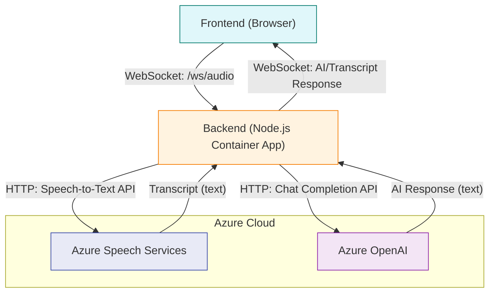

# AIMCS Backend with WebSocket Audio Support

This is the backend server for the AIMCS (AI Multimodal Customer System) with real-time WebSocket audio streaming capabilities.

## ⚠️ CRITICAL: Backend File Structure

**IMPORTANT: This repository contains BOTH frontend and backend code. Use the correct files for backend operations!**

### Backend-Specific Files

| File | Purpose | Usage |
|------|---------|-------|
| `backend-server.js` | **Main backend server** | Production API server for Azure Container Apps |
| `backend-package.json` | **Backend dependencies** | Copy to `package.json` for backend development |
| `backend-Dockerfile` | **Backend container** | Use for Docker builds |

### Common Backend Mistakes

❌ **DON'T**: Use `src/server.js` - this doesn't exist  
❌ **DON'T**: Use root `package.json` - this is for frontend  
❌ **DON'T**: Use root `server.js` - this is for frontend dev server  
✅ **DO**: Use `backend-server.js` for all backend operations  
✅ **DO**: Use `backend-package.json` for backend dependencies  
✅ **DO**: Use `backend-Dockerfile` for container builds  

### Backend Development Setup

```bash
# 1. Copy backend package.json
cp backend-package.json package.json

# 2. Install backend dependencies
npm install

# 3. Start backend server
node backend-server.js
```

### Backend Deployment

```bash
# Build backend container (uses backend-Dockerfile)
docker build -f backend-Dockerfile -t aimcs-backend:latest .

# Deploy to Azure Container Apps
az containerapp update --name aimcs-backend-eastus2 --resource-group aimcs-rg-eastus2 --image aimcsregistry.azurecr.io/aimcs-backend:latest
```

## 🚀 **Current Status**

**✅ DEPLOYED AND OPERATIONAL**

- **Backend URL**: https://aimcs-backend-eastus2.greenwave-bb2ac4ae.eastus2.azurecontainerapps.io
- **WebSocket Endpoint**: wss://aimcs-backend-eastus2.greenwave-bb2ac4ae.eastus2.azurecontainerapps.io/ws/audio
- **Region**: eastus2
- **Platform**: Azure Container Apps

## 🏗️ **Architecture**

```
┌─────────────────────────────────────────────────────────────┐
│                    AIMCS Backend (eastus2)                  │
├─────────────────────────────────────────────────────────────┤
│  Node.js Express Server                                     │
│  ├── HTTP API Endpoints                                     │
│  │   ├── GET /health                                        │
│  │   ├── GET /api/status                                    │
│  │   └── POST /api/chat                                     │
│  └── WebSocket Server                                       │
│      └── WS /ws/audio                                       │
├─────────────────────────────────────────────────────────────┤
│  Azure Container Apps                                       │
│  ├── Auto-scaling (1-3 replicas)                           │
│  ├── Health monitoring                                      │
│  └── HTTPS/WSS support                                      │
└─────────────────────────────────────────────────────────────┘
```

### Real-Time Audio/AI Flow



**Flow Explanation:**
- The frontend streams audio to the backend via WebSocket (`/ws/audio`).
- The backend can send the audio to Azure Speech Services for transcription.
- The backend can send the transcript to Azure OpenAI for an AI response.
- The backend sends the transcript and/or AI response back to the frontend via WebSocket.
- All communication with Azure services is via HTTP APIs from the backend (never direct from the browser).

## 📡 **API Endpoints**

### HTTP Endpoints

| Endpoint | Method | Description | Response |
|----------|--------|-------------|----------|
| `/health` | GET | Health check | Status, uptime, connections |
| `/api/status` | GET | API status | Endpoints, active connections |
| `/api/chat` | POST | Chat API | Echo response for testing |

### WebSocket Endpoint

| Endpoint | Protocol | Description |
|----------|----------|-------------|
| `/ws/audio` | WSS | Real-time audio streaming |

## 🔌 **WebSocket Message Types**

### From Frontend to Backend

| Type | Payload | Description |
|------|---------|-------------|
| `test` | `{message: string, timestamp: string}` | Test connection |
| `audio` | `{data: base64, timestamp: string}` | Audio data stream |
| `ping` | `{}` | Keep-alive ping |

### From Backend to Frontend

| Type | Payload | Description |
|------|---------|-------------|
| `connection` | `{connectionId: string, message: string}` | Connection established |
| `test_response` | `{originalMessage: string, message: string}` | Test response |
| `audio_received` | `{dataSize: number, message: string}` | Audio acknowledgment |
| `pong` | `{timestamp: string}` | Ping response |
| `error` | `{message: string, error: string}` | Error message |

## 🚀 **Deployment**

### Prerequisites

1. **Azure CLI** installed and logged in
2. **Docker** installed and running
3. **Node.js** 18+ for local development

### Quick Deployment

```bash
# Make script executable
chmod +x deploy-backend.sh

# Deploy to Azure Container Apps
./deploy-backend.sh
```

### Manual Deployment Steps

1. **Build Docker Image**:
   ```bash
   docker build -f backend-Dockerfile -t aimcs-backend:latest .
   ```