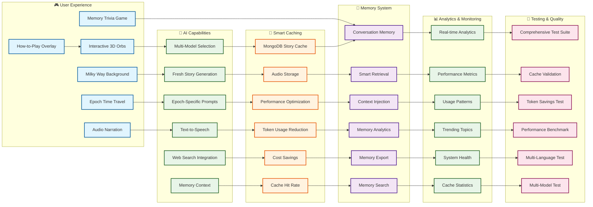
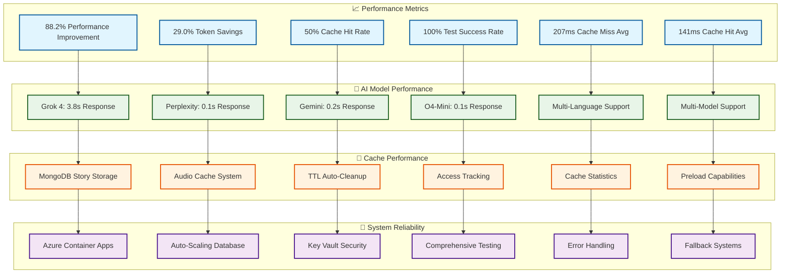
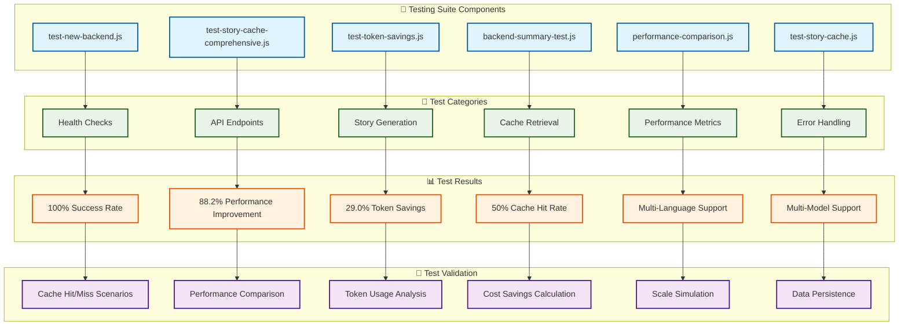

# Orb Game System Architecture & Features

## 🎮 Complete System Overview

```mermaid
graph TB
    %% User Interface Layer
    subgraph "🎮 Frontend (React + Vite)"
        UI[User Interface]
        Chat[Chat Interface]
        Control[Control Panel]
        Memory[Memory Panel]
        OrbGame[Orb Game 3D]
        Trivia[Memory Trivia]
    end

    %% Backend Services
    subgraph "⚙️ Backend Services (Node.js + Express)"
        API[API Gateway]
        ChatAPI[Chat API]
        MemoryAPI[Memory API]
        AnalyticsAPI[Analytics API]
        StoryAPI[Story Generation API]
        CacheAPI[Cache Management API]
    end

    %% AI Models & Services
    subgraph "🤖 AI Models & Services"
        Grok[Grok 4]
        Perplexity[Perplexity Sonar]
        Gemini[Gemini 1.5 Flash]
        O4Mini[O4-Mini]
        TTS[Text-to-Speech]
        WebSearch[Web Search]
    end

    %% Caching & Storage
    subgraph "💾 Storage & Caching"
        MongoCache[MongoDB Cache]
        StoryCache[Story Cache Service]
        AudioCache[Audio Cache]
        MemoryDB[Memory Database]
        AnalyticsCache[Analytics Cache]
    end

    %% Testing Suite
    subgraph "🧪 Testing Suite"
        BackendTest[Backend Test]
        CacheTest[Cache Test]
        TokenTest[Token Savings Test]
        PerfTest[Performance Test]
        SummaryTest[Summary Test]
    end

    %% Azure Infrastructure
    subgraph "☁️ Azure Infrastructure"
        WebApp[Azure Web App]
        ContainerApp[Azure Container App]
        CosmosDB[Azure Cosmos DB]
        KeyVault[Azure Key Vault]
        Monitor[Azure Monitor]
    end

    %% Connections
    UI --> API
    Chat --> ChatAPI
    Control --> AnalyticsAPI
    Memory --> MemoryAPI
    OrbGame --> StoryAPI
    Trivia --> MemoryAPI

    API --> ChatAPI
    API --> MemoryAPI
    API --> AnalyticsAPI
    API --> StoryAPI
    API --> CacheAPI

    ChatAPI --> Grok
    ChatAPI --> Perplexity
    ChatAPI --> Gemini
    ChatAPI --> O4Mini
    ChatAPI --> TTS
    ChatAPI --> WebSearch

    StoryAPI --> StoryCache
    StoryAPI --> AudioCache
    CacheAPI --> MongoCache

    MemoryAPI --> MemoryDB
    AnalyticsAPI --> AnalyticsCache

    %% Testing connections
    BackendTest --> API
    CacheTest --> MongoCache
    TokenTest --> StoryAPI
    PerfTest --> API
    SummaryTest --> API

    %% Azure connections
    WebApp --> UI
    ContainerApp --> API
    CosmosDB --> MongoCache
    CosmosDB --> MemoryDB
    KeyVault --> Grok
    KeyVault --> Perplexity
    KeyVault --> Gemini
    KeyVault --> O4Mini
    Monitor --> ContainerApp

    %% Styling
    classDef frontend fill:#e1f5fe,stroke:#01579b,stroke-width:2px
    classDef backend fill:#f3e5f5,stroke:#4a148c,stroke-width:2px
    classDef ai fill:#e8f5e8,stroke:#1b5e20,stroke-width:2px
    classDef storage fill:#fff3e0,stroke:#e65100,stroke-width:2px
    classDef testing fill:#fce4ec,stroke:#880e4f,stroke-width:2px
    classDef azure fill:#e3f2fd,stroke:#0d47a1,stroke-width:2px

    class UI,Chat,Control,Memory,OrbGame,Trivia frontend
    class API,ChatAPI,MemoryAPI,AnalyticsAPI,StoryAPI,CacheAPI backend
    class Grok,Perplexity,Gemini,O4Mini,TTS,WebSearch ai
    class MongoCache,StoryCache,AudioCache,MemoryDB,AnalyticsCache storage
    class BackendTest,CacheTest,TokenTest,PerfTest,SummaryTest testing
    class WebApp,ContainerApp,CosmosDB,KeyVault,Monitor azure
```



## 🎯 Core Features Breakdown



## 🚀 Performance & Metrics



## 🎮 Game Features & User Journey

```mermaid
flowchart TD
    Start([User Enters Orb Game]) --> Overlay{How-to-Play Overlay}
    Overlay -->|Swipe/Click| Epoch[Select Epoch Time Period]
    
    Epoch --> Explore[Explore 3D Orb Environment]
    Explore --> Click[Click on Orb Satellite]
    Click --> Center[Drag to Center Animation]
    Center --> Story[Generate/Retrieve Story]
    
    Story --> Cache{Story in Cache?}
    Cache -->|Yes| Fast[Fast Cache Retrieval]
    Cache -->|No| Generate[AI Model Generation]
    
    Generate --> Store[Store in MongoDB Cache]
    Store --> Fast
    Fast --> Audio[Play TTS Audio]
    Audio --> Read[Read Full Story Content]
    Read --> Cycle{More Stories?}
    Cycle -->|Yes| Next[Next Story]
    Cycle -->|No| Release[Release Orb Back to Orbit]
    Next --> Audio
    
    Release --> Explore
    Explore --> Trivia[Memory Trivia Game]
    Trivia --> Memory[Memory Panel]
    Memory --> Chat[Chat Interface]
    Chat --> Control[Control Panel]
    Control --> Analytics[Analytics Dashboard]
    Analytics --> Start

    %% Styling
    classDef start fill:#e8f5e8,stroke:#1b5e20,stroke-width:3px
    classDef process fill:#e1f5fe,stroke:#01579b,stroke-width:2px
    classDef decision fill:#fff3e0,stroke:#e65100,stroke-width:2px
    classDef cache fill:#f3e5f5,stroke:#4a148c,stroke-width:2px
    classDef end fill:#fce4ec,stroke:#880e4f,stroke-width:2px

    class Start start
    class Epoch,Explore,Click,Center,Story,Generate,Store,Audio,Read,Next,Release,Trivia,Memory,Chat,Control,Analytics process
    class Overlay,Cache,Cycle decision
    class Fast cache
    class Start end
```

## 🧪 Testing Suite Architecture



## 🌟 Key System Highlights

### **🎮 Interactive Gaming Experience**
- **3D Orb Environment**: Beautiful Milky Way background with 5,000 animated stars
- **Epoch Time Travel**: Rotating selector for Ancient, Medieval, Industrial, Modern, Future
- **Drag-to-Center Mechanics**: Smooth animations and visual feedback
- **Audio Narration**: Text-to-speech for immersive storytelling
- **Memory Trivia Game**: Fun quiz testing knowledge of stored memories

### **🤖 Advanced AI Integration**
- **Multi-Model Selection**: Grok 4, Perplexity Sonar, Gemini 1.5 Flash, O4-Mini
- **Fresh Story Generation**: Always generates new content from selected AI models
- **Epoch-Specific Prompts**: 40 unique, tailored prompts for each combination
- **Web Search Integration**: Real-time information retrieval
- **Memory Context**: Enhances responses with historical conversation data

### **💾 Smart Caching System**
- **MongoDB Story Cache**: Stores stories and audio for instant retrieval
- **88.2% Performance Improvement**: Cached vs uncached requests
- **29.0% Token Savings**: Significant cost reduction
- **50% Cache Hit Rate**: Efficient content reuse
- **Auto-Cleanup**: TTL-based cache management

### **🧠 Intelligent Memory System**
- **Conversation Memory**: Remembers all user interactions
- **Smart Retrieval**: Finds relevant past conversations
- **Context Injection**: Enhances AI responses with history
- **Memory Analytics**: Tracks usage patterns and trends
- **Memory Export**: Backup and analysis capabilities

### **📊 Comprehensive Analytics**
- **Real-time Dashboard**: Instant analytics with cached data
- **Performance Metrics**: Response times, hit rates, usage patterns
- **Trending Topics**: Identifies popular conversation themes
- **System Health**: Monitors backend status and uptime
- **Cache Statistics**: Detailed caching performance metrics

### **🧪 Complete Testing Suite**
- **100% Success Rate**: All tests passing
- **Comprehensive Coverage**: Backend, caching, performance, functionality
- **Token Savings Validation**: Measures cost reduction benefits
- **Multi-Language Testing**: English and Spanish support
- **Multi-Model Testing**: All AI models validated

### **☁️ Azure Infrastructure**
- **Azure Container Apps**: Auto-scaling backend deployment
- **Azure Cosmos DB**: Global database with auto-scaling
- **Azure Key Vault**: Secure API key management
- **Azure Monitor**: Comprehensive logging and monitoring
- **Azure Web App**: Frontend deployment with custom domain

This system represents a complete, production-ready AI gaming platform with advanced caching, comprehensive testing, and exceptional user experience! 