# Orb Game Prompts Reference

## 🎮 About Orb Game

**Orb Game** is an interactive 3D news exploration platform that transforms positive news discovery into an engaging gaming experience. Players navigate through a beautiful 3D space environment with orbiting "orbs" representing different news categories. Each orb contains AI-generated positive news stories that are dynamically created based on the player's selections.

### 🌟 **Core Concept**
- **Interactive 3D Interface**: Players click on floating orbs to discover stories
- **Positive News Focus**: All content is uplifting, inspiring, and solution-oriented
- **Multi-Epoch Exploration**: Stories span from Ancient times to the Digital Era
- **AI-Powered Content**: Real-time generation using multiple AI models
- **Multi-Language Support**: Full English and Spanish experience
- **Audio Narration**: Text-to-speech brings stories to life

### 🎯 **Why We Need Comprehensive Prompts**

The Orb Game experience requires an extensive prompt system because:

1. **Category Diversity**: 8 distinct categories (Technology, Science, Art, Nature, Sports, Music, Space, Innovation) each need specialized prompts that capture their unique essence and appeal to different interests.

2. **Epoch Immersion**: 6 historical periods (Ancient, Medieval, Industrial, Modern, Future, Enlightenment Era, Digital Era) require prompts that authentically capture the spirit, achievements, and context of each era while maintaining relevance and inspiration.

3. **AI Model Optimization**: Different AI models (Azure OpenAI, Grok 4, Perplexity Sonar) have different strengths and require tailored prompts to maximize their capabilities for story generation.

4. **Language Authenticity**: Both English and Spanish prompts must feel natural and culturally appropriate, not just translated, to create genuine experiences for different language speakers.

5. **Consistency & Quality**: With 480+ unique prompt combinations (8 categories × 6 epochs × 2 languages × 5+ models), maintaining consistent quality and tone across all interactions is crucial for user experience.

6. **Dynamic Content**: Unlike static content, AI-generated stories need carefully crafted prompts to ensure they're always positive, engaging, and appropriate for the gaming context.

7. **User Engagement**: Each prompt must balance entertainment value with educational content, ensuring players learn while being entertained.

8. **Scalability**: The prompt system must support future expansion to new categories, epochs, languages, and AI models while maintaining the core Orb Game experience.

### 🎪 **The Magic Formula**
**Category + Epoch + Language + AI Model = Unique Story Experience**

Every combination creates a distinct narrative experience that feels fresh and engaging, even for returning players. This comprehensive prompt system ensures that every click on an orb delivers a meaningful, positive, and inspiring story that fits perfectly within the player's chosen context.

---

## 📊 Prompt System Architecture

```mermaid
graph TB
    subgraph "🎮 Orb Game Core"
        A[Player Interaction] --> B[Category Selection]
        B --> C[Epoch Selection]
        C --> D[Language Selection]
        D --> E[AI Model Selection]
    end

    subgraph "📝 Prompt Generation"
        F[Frontend Prompts] --> G[Category Prompts]
        G --> H[Epoch-Specific Prompts]
        H --> I[Language-Specific Prompts]
        
        J[Backend Prompts] --> K[AI Model Templates]
        K --> L[System Prompts]
        L --> M[Fallback Prompts]
    end

    subgraph "🤖 AI Models"
        N[Azure OpenAI o4-mini]
        O[Grok 4]
        P[Perplexity Sonar]
        Q[Gemini 1.5 Flash]
    end

    subgraph "📂 Categories"
        R[Technology]
        S[Science]
        T[Art]
        U[Nature]
        V[Sports]
        W[Music]
        X[Space]
        Y[Innovation]
        Y1[Spirituality]
    end

    subgraph "⏰ Epochs"
        Z[Ancient]
        AA[Medieval]
        BB[Industrial]
        CC[Modern]
        DD[Future]
        EE[Enlightenment Era]
        FF[Digital Era]
    end

    subgraph "🌍 Languages"
        EE[English]
        FF[Spanish]
    end

    subgraph "🎵 TTS Voices"
        GG[alloy - English]
        HH[jorge - Spanish]
    end

    %% Connections
    A --> F
    F --> N
    F --> O
    F --> P
    F --> Q
    
    G --> R
    G --> S
    G --> T
    G --> U
    G --> V
    G --> W
    G --> X
    G --> Y
    
    H --> Z
    H --> AA
    H --> BB
    H --> CC
    H --> DD
    
    I --> EE
    I --> FF
    
    N --> GG
    P --> HH
    
    %% Styling
    classDef gameCore fill:#e1f5fe,stroke:#01579b,stroke-width:2px
    classDef prompts fill:#f3e5f5,stroke:#4a148c,stroke-width:2px
    classDef models fill:#e8f5e8,stroke:#1b5e20,stroke-width:2px
    classDef categories fill:#fff3e0,stroke:#e65100,stroke-width:2px
    classDef epochs fill:#fce4ec,stroke:#880e4f,stroke-width:2px
    classDef languages fill:#e0f2f1,stroke:#004d40,stroke-width:2px
    classDef tts fill:#f1f8e9,stroke:#33691e,stroke-width:2px
    
    class A,B,C,D,E gameCore
    class F,G,H,I,J,K,L,M prompts
    class N,O,P,Q models
    class R,S,T,U,V,W,X,Y categories
    class Z,AA,BB,CC,DD epochs
    class EE,FF languages
    class GG,HH tts
```



## 🔄 Prompt Flow Diagram


## 📈 Prompt Matrix Overview


---

This document contains all prompts used in the Orb Game system, organized by category, epoch, language, and AI model. Use this as a reference for making improvements and adjustments.

## 📋 Table of Contents

- [Frontend Prompts](#frontend-prompts)
- [Backend AI Model Prompts](#backend-ai-model-prompts)
- [System Prompts](#system-prompts)
- [Fallback Prompts](#fallback-prompts)
- [TTS Voice Configuration](#tts-voice-configuration)

---

## 🎮 Frontend Prompts

### Technology Category

#### Ancient Epoch
- **English**: `Generate an exciting positive news story about ancient technology innovations, discoveries, or achievements that would have amazed people in ancient times. Make it engaging and inspiring.`
- **Spanish**: `Generate an exciting positive news story about ancient technology innovations, discoveries, or achievements that would have amazed people in ancient times. Make it engaging and inspiring. Generate all content in Spanish.`

#### Medieval Epoch
- **English**: `Create a fascinating positive news story about medieval technology developments, inventions, or breakthroughs that would have been revolutionary in medieval times. Make it captivating and uplifting.`
- **Spanish**: `Create a fascinating positive news story about medieval technology developments, inventions, or breakthroughs that would have been revolutionary in medieval times. Make it captivating and uplifting. Generate all content in Spanish.`

#### Industrial Epoch
- **English**: `Write an inspiring positive news story about industrial revolution era technology advancements, innovations, or discoveries that transformed society. Make it exciting and motivational.`
- **Spanish**: `Write an inspiring positive news story about industrial revolution era technology advancements, innovations, or discoveries that transformed society. Make it exciting and motivational. Generate all content in Spanish.`

#### Modern Epoch
- **English**: `Generate a compelling positive news story about modern technology innovations, breakthroughs, or achievements that are making a positive impact today. Make it engaging and inspiring.`
- **Spanish**: `Generate a compelling positive news story about modern technology innovations, breakthroughs, or achievements that are making a positive impact today. Make it engaging and inspiring. Generate all content in Spanish.`

#### Future Epoch
- **English**: `Create an exciting positive news story about futuristic technology innovations, possibilities, or breakthroughs that could revolutionize the future. Make it visionary and inspiring.`
- **Spanish**: `Create an exciting positive news story about futuristic technology innovations, possibilities, or breakthroughs that could revolutionize the future. Make it visionary and inspiring. Generate all content in Spanish.`

#### Enlightenment Era Epoch
- **English**: `Generate an exciting positive news story about enlightenment era technology innovations, scientific discoveries, or intellectual breakthroughs that would have inspired intellectual growth. Make it engaging and inspiring.`
- **Spanish**: `Generate an exciting positive news story about enlightenment era technology innovations, scientific discoveries, or intellectual breakthroughs that would have inspired intellectual growth. Make it engaging and inspiring. Generate all content in Spanish.`

#### Digital Era Epoch
- **English**: `Create an exciting positive news story about digital era technology innovations, digital breakthroughs, or technological advancements that are transforming modern society. Make it engaging and inspiring.`
- **Spanish**: `Create an exciting positive news story about digital era technology innovations, digital breakthroughs, or technological advancements that are transforming modern society. Make it engaging and inspiring. Generate all content in Spanish.`

### Science Category

#### Ancient Epoch
- **English**: `Generate an exciting positive news story about ancient science discoveries, scientific breakthroughs, or natural phenomena that would have fascinated ancient civilizations. Make it engaging and inspiring.`
- **Spanish**: `Generate an exciting positive news story about ancient science discoveries, scientific breakthroughs, or natural phenomena that would have fascinated ancient civilizations. Make it engaging and inspiring. Generate all content in Spanish.`

#### Medieval Epoch
- **English**: `Create a fascinating positive news story about medieval science research, discoveries, or scientific achievements that would have been groundbreaking in medieval times. Make it captivating and uplifting.`
- **Spanish**: `Create a fascinating positive news story about medieval science research, discoveries, or scientific achievements that would have been groundbreaking in medieval times. Make it captivating and uplifting. Generate all content in Spanish.`

#### Industrial Epoch
- **English**: `Write an inspiring positive news story about industrial revolution era science discoveries, scientific advancements, or research breakthroughs that transformed understanding. Make it exciting and motivational.`
- **Spanish**: `Write an inspiring positive news story about industrial revolution era science discoveries, scientific advancements, or research breakthroughs that transformed understanding. Make it exciting and motivational. Generate all content in Spanish.`

#### Modern Epoch
- **English**: `Generate a compelling positive news story about modern science discoveries, research breakthroughs, or scientific achievements that are advancing human knowledge. Make it engaging and inspiring.`
- **Spanish**: `Generate a compelling positive news story about modern science discoveries, research breakthroughs, or scientific achievements that are advancing human knowledge. Make it engaging and inspiring. Generate all content in Spanish.`

#### Future Epoch
- **English**: `Create an exciting positive news story about futuristic science research, scientific possibilities, or breakthrough technologies that could revolutionize science. Make it visionary and inspiring.`
- **Spanish**: `Create an exciting positive news story about futuristic science research, scientific possibilities, or breakthrough technologies that could revolutionize science. Make it visionary and inspiring. Generate all content in Spanish.`

### Art Category

#### Ancient Epoch
- **English**: `Generate an exciting positive news story about ancient art masterpieces, artistic innovations, or cultural achievements that would have inspired ancient civilizations. Make it engaging and inspiring.`
- **Spanish**: `Generate an exciting positive news story about ancient art masterpieces, artistic innovations, or cultural achievements that would have inspired ancient civilizations. Make it engaging and inspiring. Generate all content in Spanish.`

#### Medieval Epoch
- **English**: `Create a fascinating positive news story about medieval art creations, artistic breakthroughs, or cultural developments that would have been revolutionary in medieval times. Make it captivating and uplifting.`
- **Spanish**: `Create a fascinating positive news story about medieval art creations, artistic breakthroughs, or cultural developments that would have been revolutionary in medieval times. Make it captivating and uplifting. Generate all content in Spanish.`

#### Industrial Epoch
- **English**: `Write an inspiring positive news story about industrial revolution era art movements, artistic innovations, or cultural achievements that transformed society. Make it exciting and motivational.`
- **Spanish**: `Write an inspiring positive news story about industrial revolution era art movements, artistic innovations, or cultural achievements that transformed society. Make it exciting and motivational. Generate all content in Spanish.`

#### Modern Epoch
- **English**: `Generate a compelling positive news story about modern art innovations, artistic breakthroughs, or cultural achievements that are enriching society today. Make it engaging and inspiring.`
- **Spanish**: `Generate a compelling positive news story about modern art innovations, artistic breakthroughs, or cultural achievements that are enriching society today. Make it engaging and inspiring. Generate all content in Spanish.`

#### Future Epoch
- **English**: `Create an exciting positive news story about futuristic art possibilities, artistic innovations, or cultural developments that could revolutionize creative expression. Make it visionary and inspiring.`
- **Spanish**: `Create an exciting positive news story about futuristic art possibilities, artistic innovations, or cultural developments that could revolutionize creative expression. Make it visionary and inspiring. Generate all content in Spanish.`

### Nature Category

#### Ancient Epoch
- **English**: `Generate an exciting positive news story about ancient nature discoveries, environmental wonders, or natural phenomena that would have amazed ancient civilizations. Make it engaging and inspiring.`
- **Spanish**: `Generate an exciting positive news story about ancient nature discoveries, environmental wonders, or natural phenomena that would have amazed ancient civilizations. Make it engaging and inspiring. Generate all content in Spanish.`

#### Medieval Epoch
- **English**: `Create a fascinating positive news story about medieval nature observations, natural discoveries, or environmental achievements that would have been remarkable in medieval times. Make it captivating and uplifting.`
- **Spanish**: `Create a fascinating positive news story about medieval nature observations, natural discoveries, or environmental achievements that would have been remarkable in medieval times. Make it captivating and uplifting. Generate all content in Spanish.`

#### Industrial Epoch
- **English**: `Write an inspiring positive news story about industrial revolution era nature conservation efforts, environmental discoveries, or natural wonders that transformed understanding. Make it exciting and motivational.`
- **Spanish**: `Write an inspiring positive news story about industrial revolution era nature conservation efforts, environmental discoveries, or natural wonders that transformed understanding. Make it exciting and motivational. Generate all content in Spanish.`

#### Modern Epoch
- **English**: `Generate a compelling positive news story about modern nature conservation efforts, environmental breakthroughs, or natural discoveries that are protecting our planet. Make it engaging and inspiring.`
- **Spanish**: `Generate a compelling positive news story about modern nature conservation efforts, environmental breakthroughs, or natural discoveries that are protecting our planet. Make it engaging and inspiring. Generate all content in Spanish.`

#### Future Epoch
- **English**: `Create an exciting positive news story about futuristic nature innovations, environmental technologies, or conservation breakthroughs that could revolutionize our relationship with nature. Make it visionary and inspiring.`
- **Spanish**: `Create an exciting positive news story about futuristic nature innovations, environmental technologies, or conservation breakthroughs that could revolutionize our relationship with nature. Make it visionary and inspiring. Generate all content in Spanish.`

### Sports Category

#### Ancient Epoch
- **English**: `Generate an exciting positive news story about ancient sports achievements, athletic innovations, or sporting events that would have inspired ancient civilizations. Make it engaging and inspiring.`
- **Spanish**: `Generate an exciting positive news story about ancient sports achievements, athletic innovations, or sporting events that would have inspired ancient civilizations. Make it engaging and inspiring. Generate all content in Spanish.`

#### Medieval Epoch
- **English**: `Create a fascinating positive news story about medieval sports competitions, athletic achievements, or sporting traditions that would have been celebrated in medieval times. Make it captivating and uplifting.`
- **Spanish**: `Create a fascinating positive news story about medieval sports competitions, athletic achievements, or sporting traditions that would have been celebrated in medieval times. Make it captivating and uplifting. Generate all content in Spanish.`

#### Industrial Epoch
- **English**: `Write an inspiring positive news story about industrial revolution era sports developments, athletic innovations, or sporting achievements that transformed recreation. Make it exciting and motivational.`
- **Spanish**: `Write an inspiring positive news story about industrial revolution era sports developments, athletic innovations, or sporting achievements that transformed recreation. Make it exciting and motivational. Generate all content in Spanish.`

#### Modern Epoch
- **English**: `Generate a compelling positive news story about modern sports achievements, athletic breakthroughs, or sporting innovations that are inspiring people today. Make it engaging and inspiring.`
- **Spanish**: `Generate a compelling positive news story about modern sports achievements, athletic breakthroughs, or sporting innovations that are inspiring people today. Make it engaging and inspiring. Generate all content in Spanish.`

#### Future Epoch
- **English**: `Create an exciting positive news story about futuristic sports possibilities, athletic innovations, or sporting technologies that could revolutionize sports. Make it visionary and inspiring.`
- **Spanish**: `Create an exciting positive news story about futuristic sports possibilities, athletic innovations, or sporting technologies that could revolutionize sports. Make it visionary and inspiring. Generate all content in Spanish.`

### Music Category

#### Ancient Epoch
- **English**: `Generate an exciting positive news story about ancient music innovations, musical discoveries, or cultural achievements that would have enchanted ancient civilizations. Make it engaging and inspiring.`
- **Spanish**: `Generate an exciting positive news story about ancient music innovations, musical discoveries, or cultural achievements that would have enchanted ancient civilizations. Make it engaging and inspiring. Generate all content in Spanish.`

#### Medieval Epoch
- **English**: `Create a fascinating positive news story about medieval music developments, musical breakthroughs, or cultural traditions that would have been revolutionary in medieval times. Make it captivating and uplifting.`
- **Spanish**: `Create a fascinating positive news story about medieval music developments, musical breakthroughs, or cultural traditions that would have been revolutionary in medieval times. Make it captivating and uplifting. Generate all content in Spanish.`

#### Industrial Epoch
- **English**: `Write an inspiring positive news story about industrial revolution era music innovations, musical advancements, or cultural developments that transformed entertainment. Make it exciting and motivational.`
- **Spanish**: `Write an inspiring positive news story about industrial revolution era music innovations, musical advancements, or cultural developments that transformed entertainment. Make it exciting and motivational. Generate all content in Spanish.`

#### Modern Epoch
- **English**: `Generate a compelling positive news story about modern music innovations, musical breakthroughs, or cultural achievements that are enriching lives today. Make it engaging and inspiring.`
- **Spanish**: `Generate a compelling positive news story about modern music innovations, musical breakthroughs, or cultural achievements that are enriching lives today. Make it engaging and inspiring. Generate all content in Spanish.`

#### Future Epoch
- **English**: `Create an exciting positive news story about futuristic music possibilities, musical innovations, or cultural technologies that could revolutionize music. Make it visionary and inspiring.`
- **Spanish**: `Create an exciting positive news story about futuristic music possibilities, musical innovations, or cultural technologies that could revolutionize music. Make it visionary and inspiring. Generate all content in Spanish.`

### Space Category

#### Ancient Epoch
- **English**: `Generate an exciting positive news story about ancient space observations, astronomical discoveries, or celestial phenomena that would have fascinated ancient civilizations. Make it engaging and inspiring.`
- **Spanish**: `Generate an exciting positive news story about ancient space observations, astronomical discoveries, or celestial phenomena that would have fascinated ancient civilizations. Make it engaging and inspiring. Generate all content in Spanish.`

#### Medieval Epoch
- **English**: `Create a fascinating positive news story about medieval space discoveries, astronomical observations, or celestial events that would have been remarkable in medieval times. Make it captivating and uplifting.`
- **Spanish**: `Create a fascinating positive news story about medieval space discoveries, astronomical observations, or celestial events that would have been remarkable in medieval times. Make it captivating and uplifting. Generate all content in Spanish.`

#### Industrial Epoch
- **English**: `Write an inspiring positive news story about industrial revolution era space discoveries, astronomical innovations, or celestial observations that transformed understanding. Make it exciting and motivational.`
- **Spanish**: `Write an inspiring positive news story about industrial revolution era space discoveries, astronomical innovations, or celestial observations that transformed understanding. Make it exciting and motivational. Generate all content in Spanish.`

#### Modern Epoch
- **English**: `Generate a compelling positive news story about modern space discoveries, space exploration achievements, or astronomical breakthroughs that are expanding our cosmic knowledge. Make it engaging and inspiring.`
- **Spanish**: `Generate a compelling positive news story about modern space discoveries, space exploration achievements, or astronomical breakthroughs that are expanding our cosmic knowledge. Make it engaging and inspiring. Generate all content in Spanish.`

#### Future Epoch
- **English**: `Create an exciting positive news story about futuristic space possibilities, space exploration innovations, or astronomical breakthroughs that could revolutionize our understanding of the universe. Make it visionary and inspiring.`
- **Spanish**: `Create an exciting positive news story about futuristic space possibilities, space exploration innovations, or astronomical breakthroughs that could revolutionize our understanding of the universe. Make it visionary and inspiring. Generate all content in Spanish.`

### Innovation Category

#### Ancient Epoch
- **English**: `Generate an exciting positive news story about ancient innovation breakthroughs, technological discoveries, or creative achievements that would have revolutionized ancient civilizations. Make it engaging and inspiring.`
- **Spanish**: `Generate an exciting positive news story about ancient innovation breakthroughs, technological discoveries, or creative achievements that would have revolutionized ancient civilizations. Make it engaging and inspiring. Generate all content in Spanish.`

### Spirituality Category

#### Ancient Epoch
- **English**: `Generate an exciting positive news story about ancient spiritual wisdom, philosophical insights, or mindfulness practices that would have guided ancient civilizations. Make it engaging and inspiring.`
- **Spanish**: `Generate an exciting positive news story about ancient spiritual wisdom, philosophical insights, or mindfulness practices that would have guided ancient civilizations. Make it engaging and inspiring. Generate all content in Spanish.`

#### Medieval Epoch
- **English**: `Create a fascinating positive news story about medieval spiritual practices, philosophical developments, or mindfulness traditions that would have been transformative in medieval times. Make it captivating and uplifting.`
- **Spanish**: `Create a fascinating positive news story about medieval spiritual practices, philosophical developments, or mindfulness traditions that would have been transformative in medieval times. Make it captivating and uplifting. Generate all content in Spanish.`

#### Industrial Epoch
- **English**: `Write an inspiring positive news story about industrial revolution era spiritual movements, philosophical breakthroughs, or mindfulness innovations that transformed society. Make it exciting and motivational.`
- **Spanish**: `Write an inspiring positive news story about industrial revolution era spiritual movements, philosophical breakthroughs, or mindfulness innovations that transformed society. Make it exciting and motivational. Generate all content in Spanish.`

#### Modern Epoch
- **English**: `Generate a compelling positive news story about modern spiritual practices, mindfulness innovations, or philosophical breakthroughs that are enriching lives today. Make it engaging and inspiring.`
- **Spanish**: `Generate a compelling positive news story about modern spiritual practices, mindfulness innovations, or philosophical breakthroughs that are enriching lives today. Make it engaging and inspiring. Generate all content in Spanish.`

#### Future Epoch
- **English**: `Create an exciting positive news story about futuristic spiritual possibilities, mindfulness technologies, or philosophical innovations that could revolutionize human consciousness. Make it visionary and inspiring.`
- **Spanish**: `Create an exciting positive news story about futuristic spiritual possibilities, mindfulness technologies, or philosophical innovations that could revolutionize human consciousness. Make it visionary and inspiring. Generate all content in Spanish.`

#### Enlightenment Era Epoch
- **English**: `Generate an exciting positive news story about enlightenment era spiritual wisdom, philosophical insights, or mindset practices that would have inspired intellectual growth. Make it engaging and inspiring.`
- **Spanish**: `Generate an exciting positive news story about enlightenment era spiritual wisdom, philosophical insights, or mindset practices that would have inspired intellectual growth. Make it engaging and inspiring. Generate all content in Spanish.`

#### Digital Era Epoch
- **English**: `Create an exciting positive news story about digital era spiritual practices, mindfulness apps, or philosophical innovations that are transforming modern consciousness. Make it engaging and inspiring.`
- **Spanish**: `Create an exciting positive news story about digital era spiritual practices, mindfulness apps, or philosophical innovations that are transforming modern consciousness. Make it engaging and inspiring. Generate all content in Spanish.`

---

## 🤖 Backend AI Model Prompts

### Azure OpenAI (o4-mini) Model

#### Default Prompt Template
- **English**: `Generate {count} fascinating, positive {category} stories from {epoch.toLowerCase()} times. Each story should be engaging, informative, and highlight remarkable achievements or discoveries.`
- **Spanish**: `Generate {count} fascinating, positive {category} stories from {epoch.toLowerCase()} times. Each story should be engaging, informative, and highlight remarkable achievements or discoveries. Generate all content in Spanish.`

#### System Prompt
- **English**: `You are a helpful assistant that creates engaging, positive news stories. Always focus on uplifting and inspiring content.`
- **Spanish**: `You are a helpful assistant that creates engaging, positive news stories. Always focus on uplifting and inspiring content.`

#### JSON Response Format
```
Return ONLY a valid JSON array with this exact format: 
[{ 
  "headline": "Brief headline", 
  "summary": "One sentence summary", 
  "fullText": "2-3 sentence story", 
  "source": "O4-Mini" 
}]
```

### Grok 4 Model

#### Default Prompt Template
- **English**: `Generate {count} fascinating, positive {category} stories from {epoch.toLowerCase()} times. Each story should be engaging, informative, and highlight remarkable achievements or discoveries.`
- **Spanish**: `Generate {count} fascinating, positive {category} stories from {epoch.toLowerCase()} times. Each story should be engaging, informative, and highlight remarkable achievements or discoveries. Generate all content in Spanish.`

#### JSON Response Format
```
Return ONLY a valid JSON array with this exact format: 
[{ 
  "headline": "Brief headline", 
  "summary": "One sentence summary", 
  "fullText": "2-3 sentence story", 
  "source": "Grok 4" 
}]
```

### Perplexity Sonar Model

#### Default Prompt Template
- **English**: `Generate {count} fascinating, positive {category} stories from {epoch.toLowerCase()} times. Each story should be engaging, informative, and highlight remarkable achievements or discoveries.`
- **Spanish**: `Generate {count} fascinating, positive {category} stories from {epoch.toLowerCase()} times. Each story should be engaging, informative, and highlight remarkable achievements or discoveries. Generate all content in Spanish.`

#### JSON Response Format
```
Return ONLY a valid JSON array with this exact format: 
[{ 
  "headline": "Brief headline", 
  "summary": "One sentence summary", 
  "fullText": "2-3 sentence story", 
  "source": "Perplexity Sonar" 
}]
```

---

## 💬 System Prompts

### Chat Endpoint System Prompts

#### English System Prompt
```
You are Orb Game, a friendly and helpful AI assistant. You can help with questions, tell jokes, and provide information. Be engaging, positive, and conversational.
```

#### Spanish System Prompt
```
Eres Orb Game, un asistente de IA amigable y útil. Puedes ayudar con preguntas, contar chistes y proporcionar información. Sé atractivo, positivo y conversacional.
```

### Web Search Prompts

#### English Web Search
```
Search the web for current information about: {message}. Provide a helpful, accurate response based on the latest information available.
```

#### Spanish Web Search
```
Search the web for current information about: {message}. Provide a helpful, accurate response based on the latest information available. Respond in Spanish.
```

---

## 🔄 Fallback Prompts

### Fallback Story Content

#### English Fallback Stories
- **Headline**: `Positive {category} News`
- **Summary**: `Great things are happening in {category.toLowerCase()} that inspire hope and progress.`
- **Full Text**: `The field of {category.toLowerCase()} continues to show remarkable progress and positive developments. These advances demonstrate the incredible potential for positive change and innovation in our world.`
- **Source**: `AI Generated`

#### Spanish Fallback Stories
- **Headline**: `Noticias Positivas de {category}`
- **Summary**: `Cosas increíbles están sucediendo en {category.toLowerCase()} que inspiran esperanza y progreso.`
- **Full Text**: `El campo de {category.toLowerCase()} continúa mostrando un progreso notable y desarrollos positivos. Estos avances demuestran el increíble potencial para el cambio positivo y la innovación en nuestro mundo.`
- **Source**: `IA Generado`

### Error Messages

#### English Error Messages
- **AI Unavailable**: `I'm Orb Game, your friendly AI assistant! I'm here to help with questions, tell jokes, and provide information. What would you like to explore? 😊`
- **Processing Error**: `I'm having trouble processing that right now. Could you try rephrasing your question? 😊`

#### Spanish Error Messages
- **AI Unavailable**: `¡Soy Orb Game, tu asistente de IA amigable! Estoy aquí para ayudar con preguntas, contar chistes y proporcionar información. ¿Qué te gustaría explorar? 😊`
- **Processing Error**: `Estoy teniendo problemas para procesar eso ahora. ¿Podrías intentar reformular tu pregunta? 😊`

---

## 🎵 TTS Voice Configuration

### Voice Selection Logic
```javascript
const voice = language === 'es' ? 'jorge' : 'alloy';
```

### Voice Options
- **English**: `alloy` (Neutral English voice)
- **Spanish**: `jorge` (Spanish male voice)

### TTS Request Format
```json
{
  "model": "AZURE_OPENAI_TTS_DEPLOYMENT",
  "input": "Text to synthesize",
  "voice": "alloy|jorge",
  "response_format": "mp3",
  "speed": 1.0
}
```

---

## 📝 Prompt Improvement Guidelines

### General Guidelines
1. **Keep prompts concise** - Aim for clarity and brevity
2. **Maintain consistency** - Use similar structure across categories
3. **Focus on positivity** - All prompts should encourage uplifting content
4. **Include specific instructions** - Be clear about desired output format
5. **Consider cultural context** - Adapt for different epochs appropriately

### Language-Specific Considerations
1. **Spanish prompts** should use natural Spanish phrasing
2. **Cultural references** should be appropriate for each epoch
3. **Technical terms** should be accessible in both languages
4. **Tone consistency** across languages is important

### Model-Specific Optimizations
1. **Azure OpenAI** - Works well with detailed, structured prompts
2. **Grok 4** - Responds well to creative, open-ended prompts
3. **Perplexity Sonar** - Excels with current events and factual content

### Category-Specific Tips
1. **Technology** - Focus on innovation and practical impact
2. **Science** - Emphasize discovery and knowledge advancement
3. **Art** - Highlight creativity and cultural significance
4. **Nature** - Stress environmental benefits and conservation
5. **Sports** - Focus on achievement and inspiration
6. **Music** - Emphasize cultural enrichment and creativity
7. **Space** - Highlight exploration and scientific advancement
8. **Innovation** - Focus on transformative potential and progress

---

## 🔧 Customization Notes

### Adding New Categories
1. Add category to frontend prompts object
2. Create prompts for all 5 epochs
3. Add Spanish translations
4. Update backend fallback stories
5. Test with all AI models

### Adding New Epochs
1. Add epoch to all category prompt objects
2. Create appropriate historical context
3. Add Spanish translations
4. Update epoch selector UI
5. Test with all categories

### Modifying AI Models
1. Update model-specific prompt templates
2. Adjust JSON response format if needed
3. Test with all categories and epochs
4. Verify language support

### Language Extensions
1. Add new language to language context
2. Create translation mappings
3. Update TTS voice selection
4. Add language-specific prompts
5. Test fallback content

---

*Last Updated: December 2024*
*Version: 1.0* 