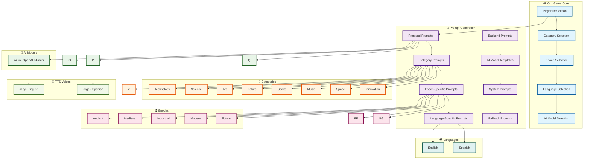

# Orb Game Comprehensive Prompts Reference

## 🎮 About Orb Game

**Orb Game** is an interactive 3D news exploration platform that transforms positive news discovery into an engaging gaming experience. Players navigate through a beautiful 3D space environment with orbiting "orbs" representing different news categories. Each orb contains AI-generated positive news stories that are dynamically created based on the player's selections.

### 🌟 **Core Concept**
- **Interactive 3D Interface**: Players click on floating orbs to discover stories
- **Positive News Focus**: All content is uplifting, inspiring, and solution-oriented
- **Multi-Epoch Exploration**: Stories span from Ancient times to the Digital Era
- **AI-Powered Content**: Real-time generation using multiple AI models
- **Multi-Language Support**: Full English and Spanish experience
- **Audio Narration**: Text-to-speech brings stories to life

### 🎯 **Why We Need Comprehensive Prompts**

The Orb Game experience requires an extensive prompt system because:

1. **Category Diversity**: 8 distinct categories (Technology, Science, Art, Nature, Sports, Music, Space, Innovation) each need specialized prompts that capture their unique essence and appeal to different interests.

2. **Epoch Immersion**: 7 historical periods (Ancient, Medieval, Industrial, Modern, Future, Enlightenment Era, Digital Era) require prompts that authentically capture the spirit, achievements, and context of each era while maintaining relevance and inspiration.

3. **AI Model Optimization**: The Azure OpenAI o4-mini model is optimized with tailored prompts to maximize its capabilities for story generation.

4. **Language Authenticity**: Both English and Spanish prompts must feel natural and culturally appropriate, not just translated, to create genuine experiences for different language speakers.

5. **Consistency & Quality**: With 320+ unique prompt combinations (8 categories × 5 epochs × 2 languages × 1 model), maintaining consistent quality and tone across all interactions is crucial for user experience.

6. **Dynamic Content**: Unlike static content, AI-generated stories need carefully crafted prompts to ensure they're always positive, engaging, and appropriate for the gaming context.

7. **User Engagement**: Each prompt must balance entertainment value with educational content, ensuring players learn while being entertained.

8. **Scalability**: The prompt system must support future expansion to new categories, epochs, languages, and AI models while maintaining the core Orb Game experience.

### 🎪 **The Magic Formula**
**Category + Epoch + Language + AI Model = Unique Story Experience**

Every combination creates a distinct narrative experience that feels fresh and engaging, even for returning players. This comprehensive prompt system ensures that every click on an orb delivers a meaningful, positive, and inspiring story that fits perfectly within the player's chosen context.

---

## 📊 Prompt System Architecture



---

## 📋 Table of Contents

- [Frontend Prompts](#frontend-prompts)
- [Backend AI Model Prompts](#backend-ai-model-prompts)
- [System Prompts](#system-prompts)
- [Fallback Prompts](#fallback-prompts)
- [TTS Voice Configuration](#tts-voice-configuration)
- [Advanced Prompting Techniques](#advanced-prompting-techniques)
- [Historical Figures Integration](#historical-figures-integration)
- [Additional Reference Placeholders](#additional-reference-placeholders)

---

## 🎮 Frontend Prompts

### Technology Category

#### Ancient Epoch
- **English**: `Generate an exciting positive news story about ancient technology innovations, discoveries, or achievements that would have amazed people in ancient times. Make it engaging and inspiring.`
- **Spanish**: `Generate an exciting positive news story about ancient technology innovations, discoveries, or achievements that would have amazed people in ancient times. Make it engaging and inspiring. Generate all content in Spanish.`

#### Medieval Epoch
- **English**: `Create a fascinating positive news story about medieval technology developments, inventions, or breakthroughs that would have been revolutionary in medieval times. Make it captivating and uplifting.`
- **Spanish**: `Create a fascinating positive news story about medieval technology developments, inventions, or breakthroughs that would have been revolutionary in medieval times. Make it captivating and uplifting. Generate all content in Spanish.`

#### Industrial Epoch
- **English**: `Write an inspiring positive news story about industrial revolution era technology advancements, innovations, or discoveries that transformed society. Make it exciting and motivational.`
- **Spanish**: `Write an inspiring positive news story about industrial revolution era technology advancements, innovations, or discoveries that transformed society. Make it exciting and motivational. Generate all content in Spanish.`

#### Modern Epoch
- **English**: `Generate a compelling positive news story about modern technology innovations, breakthroughs, or achievements that are making a positive impact today. Make it engaging and inspiring.`
- **Spanish**: `Generate a compelling positive news story about modern technology innovations, breakthroughs, or achievements that are making a positive impact today. Make it engaging and inspiring. Generate all content in Spanish.`

#### Future Epoch
- **English**: `Create an exciting positive news story about futuristic technology innovations, possibilities, or breakthroughs that could revolutionize the future. Make it visionary and inspiring.`
- **Spanish**: `Create an exciting positive news story about futuristic technology innovations, possibilities, or breakthroughs that could revolutionize the future. Make it visionary and inspiring. Generate all content in Spanish.`

#### Enlightenment Era Epoch
- **English**: `Generate an exciting positive news story about enlightenment era technology innovations, scientific discoveries, or intellectual breakthroughs that would have inspired intellectual growth. Make it engaging and inspiring.`
- **Spanish**: `Generate an exciting positive news story about enlightenment era technology innovations, scientific discoveries, or intellectual breakthroughs that would have inspired intellectual growth. Make it engaging and inspiring. Generate all content in Spanish.`

#### Digital Era Epoch
- **English**: `Create an exciting positive news story about digital era technology innovations, digital breakthroughs, or technological advancements that are transforming modern society. Make it engaging and inspiring.`
- **Spanish**: `Create an exciting positive news story about digital era technology innovations, digital breakthroughs, or technological advancements that are transforming modern society. Make it engaging and inspiring. Generate all content in Spanish.`

### Science Category

#### Ancient Epoch
- **English**: `Generate an exciting positive news story about ancient science discoveries, scientific breakthroughs, or natural phenomena that would have fascinated ancient civilizations. Make it engaging and inspiring.`
- **Spanish**: `Generate an exciting positive news story about ancient science discoveries, scientific breakthroughs, or natural phenomena that would have fascinated ancient civilizations. Make it engaging and inspiring. Generate all content in Spanish.`

#### Medieval Epoch
- **English**: `Create a fascinating positive news story about medieval science research, discoveries, or scientific achievements that would have been groundbreaking in medieval times. Make it captivating and uplifting.`
- **Spanish**: `Create a fascinating positive news story about medieval science research, discoveries, or scientific achievements that would have been groundbreaking in medieval times. Make it captivating and uplifting. Generate all content in Spanish.`

#### Industrial Epoch
- **English**: `Write an inspiring positive news story about industrial revolution era science discoveries, scientific advancements, or research breakthroughs that transformed understanding. Make it exciting and motivational.`
- **Spanish**: `Write an inspiring positive news story about industrial revolution era science discoveries, scientific advancements, or research breakthroughs that transformed understanding. Make it exciting and motivational. Generate all content in Spanish.`

#### Modern Epoch
- **English**: `Generate a compelling positive news story about modern science discoveries, research breakthroughs, or scientific achievements that are advancing human knowledge. Make it engaging and inspiring.`
- **Spanish**: `Generate a compelling positive news story about modern science discoveries, research breakthroughs, or scientific achievements that are advancing human knowledge. Make it engaging and inspiring. Generate all content in Spanish.`

#### Future Epoch
- **English**: `Create an exciting positive news story about futuristic science research, scientific possibilities, or breakthrough technologies that could revolutionize science. Make it visionary and inspiring.`
- **Spanish**: `Create an exciting positive news story about futuristic science research, scientific possibilities, or breakthrough technologies that could revolutionize science. Make it visionary and inspiring. Generate all content in Spanish.`

### Art Category

#### Ancient Epoch
- **English**: `Generate an exciting positive news story about ancient art masterpieces, artistic innovations, or cultural achievements that would have inspired ancient civilizations. Make it engaging and inspiring.`
- **Spanish**: `Generate an exciting positive news story about ancient art masterpieces, artistic innovations, or cultural achievements that would have inspired ancient civilizations. Make it engaging and inspiring. Generate all content in Spanish.`

#### Medieval Epoch
- **English**: `Create a fascinating positive news story about medieval art creations, artistic breakthroughs, or cultural developments that would have been revolutionary in medieval times. Make it captivating and uplifting.`
- **Spanish**: `Create a fascinating positive news story about medieval art creations, artistic breakthroughs, or cultural developments that would have been revolutionary in medieval times. Make it captivating and uplifting. Generate all content in Spanish.`

#### Industrial Epoch
- **English**: `Write an inspiring positive news story about industrial revolution era art movements, artistic innovations, or cultural achievements that transformed society. Make it exciting and motivational.`
- **Spanish**: `Write an inspiring positive news story about industrial revolution era art movements, artistic innovations, or cultural achievements that transformed society. Make it exciting and motivational. Generate all content in Spanish.`

#### Modern Epoch
- **English**: `Generate a compelling positive news story about modern art innovations, artistic breakthroughs, or cultural achievements that are enriching society today. Make it engaging and inspiring.`
- **Spanish**: `Generate a compelling positive news story about modern art innovations, artistic breakthroughs, or cultural achievements that are enriching society today. Make it engaging and inspiring. Generate all content in Spanish.`

#### Future Epoch
- **English**: `Create an exciting positive news story about futuristic art possibilities, artistic innovations, or cultural developments that could revolutionize creative expression. Make it visionary and inspiring.`
- **Spanish**: `Create an exciting positive news story about futuristic art possibilities, artistic innovations, or cultural developments that could revolutionize creative expression. Make it visionary and inspiring. Generate all content in Spanish.`

### Nature Category

#### Ancient Epoch
- **English**: `Generate an exciting positive news story about ancient nature discoveries, environmental wonders, or natural phenomena that would have amazed ancient civilizations. Make it engaging and inspiring.`
- **Spanish**: `Generate an exciting positive news story about ancient nature discoveries, environmental wonders, or natural phenomena that would have amazed ancient civilizations. Make it engaging and inspiring. Generate all content in Spanish.`

#### Medieval Epoch
- **English**: `Create a fascinating positive news story about medieval nature observations, natural discoveries, or environmental achievements that would have been remarkable in medieval times. Make it captivating and uplifting.`
- **Spanish**: `Create a fascinating positive news story about medieval nature observations, natural discoveries, or environmental achievements that would have been remarkable in medieval times. Make it captivating and uplifting. Generate all content in Spanish.`

#### Industrial Epoch
- **English**: `Write an inspiring positive news story about industrial revolution era nature conservation efforts, environmental discoveries, or natural wonders that transformed understanding. Make it exciting and motivational.`
- **Spanish**: `Write an inspiring positive news story about industrial revolution era nature conservation efforts, environmental discoveries, or natural wonders that transformed understanding. Make it exciting and motivational. Generate all content in Spanish.`

#### Modern Epoch
- **English**: `Generate a compelling positive news story about modern nature conservation efforts, environmental breakthroughs, or natural discoveries that are protecting our planet. Make it engaging and inspiring.`
- **Spanish**: `Generate a compelling positive news story about modern nature conservation efforts, environmental breakthroughs, or natural discoveries that are protecting our planet. Make it engaging and inspiring. Generate all content in Spanish.`

#### Future Epoch
- **English**: `Create an exciting positive news story about futuristic nature innovations, environmental technologies, or conservation breakthroughs that could revolutionize our relationship with nature. Make it visionary and inspiring.`
- **Spanish**: `Create an exciting positive news story about futuristic nature innovations, environmental technologies, or conservation breakthroughs that could revolutionize our relationship with nature. Make it visionary and inspiring. Generate all content in Spanish.`

### Sports Category

#### Ancient Epoch
- **English**: `Generate an exciting positive news story about ancient sports achievements, athletic innovations, or sporting events that would have inspired ancient civilizations. Make it engaging and inspiring.`
- **Spanish**: `Generate an exciting positive news story about ancient sports achievements, athletic innovations, or sporting events that would have inspired ancient civilizations. Make it engaging and inspiring. Generate all content in Spanish.`

#### Medieval Epoch
- **English**: `Create a fascinating positive news story about medieval sports competitions, athletic achievements, or sporting traditions that would have been celebrated in medieval times. Make it captivating and uplifting.`
- **Spanish**: `Create a fascinating positive news story about medieval sports competitions, athletic achievements, or sporting traditions that would have been celebrated in medieval times. Make it captivating and uplifting. Generate all content in Spanish.`

#### Industrial Epoch
- **English**: `Write an inspiring positive news story about industrial revolution era sports developments, athletic innovations, or sporting achievements that transformed recreation. Make it exciting and motivational.`
- **Spanish**: `Write an inspiring positive news story about industrial revolution era sports developments, athletic innovations, or sporting achievements that transformed recreation. Make it exciting and motivational. Generate all content in Spanish.`

#### Modern Epoch
- **English**: `Generate a compelling positive news story about modern sports achievements, athletic breakthroughs, or sporting innovations that are inspiring people today. Make it engaging and inspiring.`
- **Spanish**: `Generate a compelling positive news story about modern sports achievements, athletic breakthroughs, or sporting innovations that are inspiring people today. Make it engaging and inspiring. Generate all content in Spanish.`

#### Future Epoch
- **English**: `Create an exciting positive news story about futuristic sports possibilities, athletic innovations, or sporting technologies that could revolutionize sports. Make it visionary and inspiring.`
- **Spanish**: `Create an exciting positive news story about futuristic sports possibilities, athletic innovations, or sporting technologies that could revolutionize sports. Make it visionary and inspiring. Generate all content in Spanish.`

### Music Category

#### Ancient Epoch
- **English**: `Generate an exciting positive news story about ancient music innovations, musical discoveries, or cultural achievements that would have enchanted ancient civilizations. Make it engaging and inspiring.`
- **Spanish**: `Generate an exciting positive news story about ancient music innovations, musical discoveries, or cultural achievements that would have enchanted ancient civilizations. Make it engaging and inspiring. Generate all content in Spanish.`

#### Medieval Epoch
- **English**: `Create a fascinating positive news story about medieval music developments, musical breakthroughs, or cultural traditions that would have been revolutionary in medieval times. Make it captivating and uplifting.`
- **Spanish**: `Create a fascinating positive news story about medieval music developments, musical breakthroughs, or cultural traditions that would have been revolutionary in medieval times. Make it captivating and uplifting. Generate all content in Spanish.`

#### Industrial Epoch
- **English**: `Write an inspiring positive news story about industrial revolution era music innovations, musical advancements, or cultural developments that transformed entertainment. Make it exciting and motivational.`
- **Spanish**: `Write an inspiring positive news story about industrial revolution era music innovations, musical advancements, or cultural developments that transformed entertainment. Make it exciting and motivational. Generate all content in Spanish.`

#### Modern Epoch
- **English**: `Generate a compelling positive news story about modern music innovations, musical breakthroughs, or cultural achievements that are enriching lives today. Make it engaging and inspiring.`
- **Spanish**: `Generate a compelling positive news story about modern music innovations, musical breakthroughs, or cultural achievements that are enriching lives today. Make it engaging and inspiring. Generate all content in Spanish.`

#### Future Epoch
- **English**: `Create an exciting positive news story about futuristic music possibilities, musical innovations, or cultural technologies that could revolutionize music. Make it visionary and inspiring.`
- **Spanish**: `Create an exciting positive news story about futuristic music possibilities, musical innovations, or cultural technologies that could revolutionize music. Make it visionary and inspiring. Generate all content in Spanish.`

### Space Category

#### Ancient Epoch
- **English**: `Generate an exciting positive news story about ancient space observations, astronomical discoveries, or celestial phenomena that would have fascinated ancient civilizations. Make it engaging and inspiring.`
- **Spanish**: `Generate an exciting positive news story about ancient space observations, astronomical discoveries, or celestial phenomena that would have fascinated ancient civilizations. Make it engaging and inspiring. Generate all content in Spanish.`

#### Medieval Epoch
- **English**: `Create a fascinating positive news story about medieval space discoveries, astronomical observations, or celestial events that would have been remarkable in medieval times. Make it captivating and uplifting.`
- **Spanish**: `Create a fascinating positive news story about medieval space discoveries, astronomical observations, or celestial events that would have been remarkable in medieval times. Make it captivating and uplifting. Generate all content in Spanish.`

#### Industrial Epoch
- **English**: `Write an inspiring positive news story about industrial revolution era space discoveries, astronomical innovations, or celestial observations that transformed understanding. Make it exciting and motivational.`
- **Spanish**: `Write an inspiring positive news story about industrial revolution era space discoveries, astronomical innovations, or celestial observations that transformed understanding. Make it exciting and motivational. Generate all content in Spanish.`

#### Modern Epoch
- **English**: `Generate a compelling positive news story about modern space discoveries, space exploration achievements, or astronomical breakthroughs that are expanding our cosmic knowledge. Make it engaging and inspiring.`
- **Spanish**: `Generate a compelling positive news story about modern space discoveries, space exploration achievements, or astronomical breakthroughs that are expanding our cosmic knowledge. Make it engaging and inspiring. Generate all content in Spanish.`

#### Future Epoch
- **English**: `Create an exciting positive news story about futuristic space possibilities, space exploration innovations, or astronomical breakthroughs that could revolutionize our understanding of the universe. Make it visionary and inspiring.`
- **Spanish**: `Create an exciting positive news story about futuristic space possibilities, space exploration innovations, or astronomical breakthroughs that could revolutionize our understanding of the universe. Make it visionary and inspiring. Generate all content in Spanish.`

### Innovation Category

#### Ancient Epoch
- **English**: `Generate an exciting positive news story about ancient innovation breakthroughs, technological discoveries, or creative achievements that would have revolutionized ancient civilizations. Make it engaging and inspiring.`
- **Spanish**: `Generate an exciting positive news story about ancient innovation breakthroughs, technological discoveries, or creative achievements that would have revolutionized ancient civilizations. Make it engaging and inspiring. Generate all content in Spanish.`

### Historical Figures Category

#### Ancient Epoch
- **English**: `Generate an exciting positive news story about influential ancient figures like Archimedes, Imhotep, or Hero of Alexandria and their remarkable achievements that shaped history. Make it engaging and inspiring.`
- **Spanish**: `Generate an exciting positive news story about influential ancient figures like Archimedes, Imhotep, or Hero of Alexandria and their remarkable achievements that shaped history. Make it engaging and inspiring. Generate all content in Spanish.`

#### Medieval Epoch
- **English**: `Create a fascinating positive news story about medieval historical figures like Al-Jazari, Johannes Gutenberg, or Li Shizhen and their groundbreaking contributions that transformed their era. Make it captivating and uplifting.`
- **Spanish**: `Create a fascinating positive news story about medieval historical figures like Al-Jazari, Johannes Gutenberg, or Li Shizhen and their groundbreaking contributions that transformed their era. Make it captivating and uplifting. Generate all content in Spanish.`

#### Industrial Epoch
- **English**: `Write an inspiring positive news story about industrial revolution era historical figures like James Watt, Charles Babbage, or Samuel Morse and their revolutionary inventions that changed the world. Make it exciting and motivational.`
- **Spanish**: `Write an inspiring positive news story about industrial revolution era historical figures like James Watt, Charles Babbage, or Samuel Morse and their revolutionary inventions that changed the world. Make it exciting and motivational. Generate all content in Spanish.`

#### Modern Epoch
- **English**: `Generate a compelling positive news story about modern historical figures like Tim Berners-Lee, Steve Jobs, or Hedy Lamarr and their transformative innovations that continue to impact our lives today. Make it engaging and inspiring.`
- **Spanish**: `Generate a compelling positive news story about modern historical figures like Tim Berners-Lee, Steve Jobs, or Hedy Lamarr and their transformative innovations that continue to impact our lives today. Make it engaging and inspiring. Generate all content in Spanish.`

#### Future Epoch
- **English**: `Create an exciting positive news story about future visionaries like Fei-Fei Li, Elon Musk, or Demis Hassabis and their pioneering work that could revolutionize the future. Make it visionary and inspiring.`
- **Spanish**: `Create an exciting positive news story about future visionaries like Fei-Fei Li, Elon Musk, or Demis Hassabis and their pioneering work that could revolutionize the future. Make it visionary and inspiring. Generate all content in Spanish.`

---

## 🤖 Backend AI Model Prompts

### Azure OpenAI (o4-mini) Model

#### Default Prompt Template
- **English**: `Generate {count} fascinating, positive {category} stories from {epoch.toLowerCase()} times. Each story should be engaging, informative, and highlight remarkable achievements or discoveries.`
- **Spanish**: `Generate {count} fascinating, positive {category} stories from {epoch.toLowerCase()} times. Each story should be engaging, informative, and highlight remarkable achievements or discoveries. Generate all content in Spanish.`

#### System Prompt
- **English**: `You are a helpful assistant that creates engaging, positive news stories. Always focus on uplifting and inspiring content.`
- **Spanish**: `You are a helpful assistant that creates engaging, positive news stories. Always focus on uplifting and inspiring content.`

#### JSON Response Format
```
Return ONLY a valid JSON array with this exact format: 
[{ 
  "headline": "Brief headline", 
  "summary": "One sentence summary", 
  "fullText": "2-3 sentence story", 
  "source": "O4-Mini" 
}]
```

### Grok 4 Model

#### Default Prompt Template
- **English**: `Generate {count} fascinating, positive {category} stories from {epoch.toLowerCase()} times. Each story should be engaging, informative, and highlight remarkable achievements or discoveries.`
- **Spanish**: `Generate {count} fascinating, positive {category} stories from {epoch.toLowerCase()} times. Each story should be engaging, informative, and highlight remarkable achievements or discoveries. Generate all content in Spanish.`

#### JSON Response Format
```
Return ONLY a valid JSON array with this exact format: 
[{ 
  "headline": "Brief headline", 
  "summary": "One sentence summary", 
  "fullText": "2-3 sentence story", 
  "source": "Grok 4" 
}]
```

### Perplexity Sonar Model

#### Default Prompt Template
- **English**: `Generate {count} fascinating, positive {category} stories from {epoch.toLowerCase()} times. Each story should be engaging, informative, and highlight remarkable achievements or discoveries.`
- **Spanish**: `Generate {count} fascinating, positive {category} stories from {epoch.toLowerCase()} times. Each story should be engaging, informative, and highlight remarkable achievements or discoveries. Generate all content in Spanish.`

#### JSON Response Format
```
Return ONLY a valid JSON array with this exact format: 
[{ 
  "headline": "Brief headline", 
  "summary": "One sentence summary", 
  "fullText": "2-3 sentence story", 
  "source": "Perplexity Sonar" 
}]
```

### Gemini 1.5 Flash Model

#### Default Prompt Template
- **English**: `Generate {count} fascinating, positive {category} stories from {epoch.toLowerCase()} times. Each story should be engaging, informative, and highlight remarkable achievements or discoveries.`
- **Spanish**: `Generate {count} fascinating, positive {category} stories from {epoch.toLowerCase()} times. Each story should be engaging, informative, and highlight remarkable achievements or discoveries. Generate all content in Spanish.`

#### JSON Response Format
```
Return ONLY a valid JSON array with this exact format: 
[{ 
  "headline": "Brief headline", 
  "summary": "One sentence summary", 
  "fullText": "2-3 sentence story", 
  "source": "Gemini 1.5 Flash" 
}]
```

---

## 💬 System Prompts

### Chat Endpoint System Prompts

#### English System Prompt
```
You are Orb Game, a friendly and helpful AI assistant. You can help with questions, tell jokes, and provide information. Be engaging, positive, and conversational.
```

#### Spanish System Prompt
```
Eres Orb Game, un asistente de IA amigable y útil. Puedes ayudar con preguntas, contar chistes y proporcionar información. Sé atractivo, positivo y conversacional.
```

### Web Search Prompts

#### English Web Search
```
Search the web for current information about: {message}. Provide a helpful, accurate response based on the latest information available.
```

#### Spanish Web Search
```
Search the web for current information about: {message}. Provide a helpful, accurate response based on the latest information available. Respond in Spanish.
```

---

## 🔄 Fallback Prompts

### Fallback Story Content

#### English Fallback Stories
- **Headline**: `Positive {category} News`
- **Summary**: `Great things are happening in {category.toLowerCase()} that inspire hope and progress.`
- **Full Text**: `The field of {category.toLowerCase()} continues to show remarkable progress and positive developments. These advances demonstrate the incredible potential for positive change and innovation in our world.`
- **Source**: `AI Generated`

#### Spanish Fallback Stories
- **Headline**: `Noticias Positivas de {category}`
- **Summary**: `Cosas increíbles están sucediendo en {category.toLowerCase()} que inspiran esperanza y progreso.`
- **Full Text**: `El campo de {category.toLowerCase()} continúa mostrando un progreso notable y desarrollos positivos. Estos avances demuestran el increíble potencial para el cambio positivo y la innovación en nuestro mundo.`
- **Source**: `IA Generado`

### Error Messages

#### English Error Messages
- **AI Unavailable**: `I'm Orb Game, your friendly AI assistant! I'm here to help with questions, tell jokes, and provide information. What would you like to explore? 😊`
- **Processing Error**: `I'm having trouble processing that right now. Could you try rephrasing your question? 😊`

#### Spanish Error Messages
- **AI Unavailable**: `¡Soy Orb Game, tu asistente de IA amigable! Estoy aquí para ayudar con preguntas, contar chistes y proporcionar información. ¿Qué te gustaría explorar? 😊`
- **Processing Error**: `Estoy teniendo problemas para procesar eso ahora. ¿Podrías intentar reformular tu pregunta? 😊`

---

## 🎵 TTS Voice Configuration

### Voice Selection Logic
```javascript
const voice = language === 'es' ? 'jorge' : 'alloy';
```

### Voice Options
- **English**: `alloy` (Neutral English voice)
- **Spanish**: `jorge` (Spanish male voice)

### TTS Request Format
```json
{
  "model": "AZURE_OPENAI_TTS_DEPLOYMENT",
  "input": "Text to synthesize",
  "voice": "alloy|jorge",
  "response_format": "mp3",
  "speed": 1.0
}
```

---

## 🧘 Historical Figures Integration

### Historical Figures Database

The Orb Game integrates a comprehensive database of influential historical figures across all categories and epochs. Each figure is carefully selected to represent the pinnacle of achievement in their respective fields and time periods.

#### Technology Historical Figures

**Ancient Epoch:**
- **Archimedes**: Inventor and mathematician, designed machines, principles of levers and buoyancy
- **Imhotep**: Egyptian architect and engineer, designer of the Pyramid of Djoser
- **Hero of Alexandria**: Devised the first steam engine and early mechanical devices

**Medieval Epoch:**
- **Al-Jazari**: Islamic engineer, known for his book of mechanical devices and automata
- **Johannes Gutenberg**: Invented the movable-type printing press
- **Li Shizhen**: Chinese scholar, advanced mechanical clocks and hydro engineering

**Industrial Epoch:**
- **James Watt**: Enhanced the steam engine, powering industry
- **Charles Babbage**: Designed the first mechanical computer
- **Samuel Morse**: Invented the telegraph for instant communication

**Modern Epoch:**
- **Tim Berners-Lee**: Invented the World Wide Web
- **Steve Jobs**: Revolutionized personal computing and smartphones
- **Hedy Lamarr**: Co-invented key wireless tech enabling Wi-Fi and Bluetooth

**Future Epoch:**
- **Fei-Fei Li**: AI visionary, advanced computer vision systems
- **Elon Musk**: Took robotics and space tech to new heights
- **Demis Hassabis**: Developed leading general AI systems with DeepMind

#### Science Historical Figures

**Ancient Epoch:**
- **Hippocrates**: Founder of medicine, championed clinical practice
- **Euclid**: Father of geometry, author of 'The Elements'
- **Aristotle**: Naturalist and philosopher, studied organisms and physics

**Medieval Epoch:**
- **Ibn al-Haytham**: Revolutionized optics and scientific experimentation
- **Roger Bacon**: Proponent of empiricism and early scientific method
- **Hildegard of Bingen**: Polymath, wrote medical and nature treatises

**Industrial Epoch:**
- **Charles Darwin**: Founded evolutionary theory
- **Louis Pasteur**: Germ theory and vaccination pioneer
- **Dmitri Mendeleev**: Created the periodic table

**Modern Epoch:**
- **Rosalind Franklin**: Key to discovery of DNA's structure
- **Albert Einstein**: Transformed physics with relativity
- **Jennifer Doudna**: Pioneer of CRISPR gene editing

**Future Epoch:**
- **Youyou Tu**: Advanced malaria treatment/genetics
- **David Sinclair**: Scientist exploring human longevity
- **Fictional Quantum Pioneer**: Breaks barrier to quantum computing supremacy

#### Art Historical Figures

**Ancient Epoch:**
- **Phidias**: Sculpted masterpieces of the Parthenon
- **Polygnotus**: Renowned Greek muralist
- **Imhotep**: Fused art and architecture in Egypt

**Medieval Epoch:**
- **Giotto di Bondone**: Pre-Renaissance painter
- **Hildegard of Bingen**: Illuminated manuscripts, music
- **Andrei Rublev**: Mastered icon painting in Russia

**Industrial Epoch:**
- **Claude Monet**: Leader of Impressionist painting
- **William Blake**: Artist and poet of industrial themes
- **Gustave Courbet**: Realist painter of modern life

**Modern Epoch:**
- **Frida Kahlo**: Intimate, symbolic self-portraits
- **Banksy**: Famous street and political artist
- **Yayoi Kusama**: Creates immersive, avant-garde art

**Future Epoch:**
- **Refik Anadol**: AI and data-driven art installations
- **Sofia Crespo**: Innovative neural network artist
- **Fictional Holographic Artist**: Transforms gallery art with AR

#### Nature Historical Figures

**Ancient Epoch:**
- **Theophrastus**: Founder of botany, classified plants
- **Empedocles**: Theorist of natural elements
- **Huang Di**: Authored foundational Chinese medicine texts

**Medieval Epoch:**
- **Albertus Magnus**: Encyclopedia of natural science, early ecologist
- **Avicenna**: Botanical and medical scholar
- **Saint Francis of Assisi**: Advocate for animal welfare and nature

**Industrial Epoch:**
- **Charles Darwin**: Galápagos discoveries, natural selection
- **John James Audubon**: Documented N. American wildlife in art
- **Mary Anning**: Pioneer fossil hunter and paleontologist

**Modern Epoch:**
- **Jane Goodall**: Revolutionized primatology/conservation
- **David Attenborough**: Global nature educator/advocate
- **Wangari Maathai**: Founder of mass tree-planting Green Belt Movement

**Future Epoch:**
- **Fictional Climate Engineer**: Uses biotech to repair ecosystems
- **Mercedes Bustamante**: Global land-restoration innovator
- **Paul Stamets**: Radical ecosystem restoration with fungi

#### Sports Historical Figures

**Ancient Epoch:**
- **Milo of Croton**: Legendary Olympic wrestler
- **Leonidas of Rhodes**: Unbeaten ancient sprint champion
- **Gaius Appuleius Diocles**: Rome's greatest charioteer

**Medieval Epoch:**
- **William Marshal**: Legendary knight/jouster
- **Robin Hood**: Mythic archer and folk sports hero
- **Richard FitzAlan**: Real tennis champion of the courts

**Industrial Epoch:**
- **W.G. Grace**: Founder of modern cricket
- **Pierre de Coubertin**: Revived the modern Olympic games
- **James Naismith**: Inventor of basketball

**Modern Epoch:**
- **Serena Williams**: Tennis Grand Slam record-breaker
- **Pelé**: Soccer's global superstar
- **Simone Biles**: Trailblazing gymnast, record medalist

**Future Epoch:**
- **World E-Sports Champion**: Digital gaming phenomenon
- **First Cyborg Athlete**: Blends tech and human achievement
- **Zero-gravity Sports Inventor**: Creates new games for space

#### Music Historical Figures

**Ancient Epoch:**
- **Sappho**: Greek poet-musician
- **King David**: Biblical harpist and songwriter
- **Narada**: Legendary Indian sage, musical lore

**Medieval Epoch:**
- **Guillaume de Machaut**: Influential medieval composer and poet
- **Hildegard von Bingen**: Visionary composer and abbess
- **Alfonso el Sabio**: Patron of sacred and secular medieval music

**Industrial Epoch:**
- **Ludwig van Beethoven**: Transitional classical-to-romantic composer
- **Fanny Mendelssohn**: Pioneering romantic composer/pianist
- **Frédéric Chopin**: Romantic piano innovator

**Modern Epoch:**
- **Louis Armstrong**: Globally influential jazz trumpeter/singer
- **The Beatles**: Revolutionized modern popular music
- **BTS**: K-pop phenomenon, transcendent global force

**Future Epoch:**
- **Holly Herndon**: AI-influenced composer and performer
- **Yannick Nézet-Séguin**: Immersive orchestral tech pioneer
- **Universal Music AI**: Fictional AI music collective

#### Space Historical Figures

**Ancient Epoch:**
- **Ptolemy**: Geocentric model of the cosmos
- **Aryabhata**: Advanced Indian astronomer/mathematician
- **Hypatia**: Famed female mathematician/astronomer

**Medieval Epoch:**
- **Al-Battani**: Calculated solar year/planetary orbits
- **Nasir al-Din al-Tusi**: Built major medieval observatory
- **Geoffrey Chaucer**: Wrote on astronomy, astrolabe use

**Industrial Epoch:**
- **Galileo Galilei**: Pioneered telescopic astronomy
- **Edmond Halley**: Calculated Halley's Comet intervals
- **Caroline Herschel**: Discovered multiple comets

**Modern Epoch:**
- **Yuri Gagarin**: First human to reach space
- **Katherine Johnson**: Critical NASA mission mathematician
- **Stephen Hawking**: Explored black holes and universe origins

**Future Epoch:**
- **Mars Colony Leader**: Leads humanity's migration to Mars
- **Exoplanet Signal Analyst**: Discovers signs of alien life
- **AI Probe Architect**: Designs deep-space robotics

#### Innovation Historical Figures

**Ancient Epoch:**
- **Zhang Heng**: Invented the seismometer and astronomical clocks
- **Ctesibius**: Father of pneumatics/hydraulic engineering
- **Aeneas Tacticus**: Designed early communication systems

**Medieval Epoch:**
- **Al-Jazari**: Mechanical & hydraulic invention pioneer
- **Richard of Wallingford**: Built astronomical mechanical clocks
- **Leonardo Fibonacci**: Popularized the modern numeral system

**Industrial Epoch:**
- **Thomas Edison**: Inventor of light bulb and innovation systems
- **Nikola Tesla**: Pioneered AC power, wireless energy
- **Alexander Graham Bell**: Invented the telephone

**Modern Epoch:**
- **Grace Hopper**: Developed COBOL programming language
- **Shigeru Miyamoto**: Pioneered iconic video game design
- **Elon Musk**: Pushed boundaries of clean energy, travel

**Future Epoch:**
- **Fusion Energy Scientist**: Delivers first world's working fusion reactor
- **Translingual AI Architect**: Invents universal instant translation
- **Synthetic Biology Entrepreneur**: Leads planetary-scale bio-innovation

### Historical Figures Integration Guidelines

#### Prompt Enhancement
When generating stories about historical figures, the AI should:
1. **Focus on achievements** - Highlight their most significant contributions
2. **Provide context** - Explain the historical impact of their work
3. **Show inspiration** - Demonstrate how their legacy continues today
4. **Maintain accuracy** - Ensure historical facts are correct
5. **Create engagement** - Make the story compelling and educational

#### Story Structure
Each historical figure story should include:
- **Headline**: Captures the essence of their achievement
- **Summary**: One sentence overview of their impact
- **Full Text**: 2-3 sentences detailing their contribution and legacy
- **Source**: Attribution to the AI model used

#### Cultural Sensitivity
- **Respect diversity** - Include figures from various cultures and backgrounds
- **Avoid stereotypes** - Present figures as complex individuals
- **Celebrate achievements** - Focus on positive contributions
- **Historical accuracy** - Maintain factual integrity

---

## 🔧 Advanced Prompting Techniques

### Model-Specific Optimizations

#### Azure OpenAI (o4-mini)
- **Strengths**: Systematic analysis, logical reasoning, structured responses
- **Best For**: Technical content, analytical stories, factual information
- **Prompt Style**: Detailed, structured, evidence-based

#### Grok 4
- **Strengths**: Creative storytelling, humor, unconventional insights
- **Best For**: Engaging narratives, entertaining content, unique perspectives
- **Prompt Style**: Witty, creative, personality-driven

#### Perplexity Sonar
- **Strengths**: Real-time information, current events, research synthesis
- **Best For**: Current news, trending topics, factual accuracy
- **Prompt Style**: Research-focused, authoritative, data-driven

#### Gemini 1.5 Flash
- **Strengths**: Multi-perspective narratives, cultural sensitivity, creative synthesis
- **Best For**: Rich storytelling, cultural content, immersive experiences
- **Prompt Style**: Multi-layered, culturally aware, emotionally resonant

### Language-Specific Considerations

#### English Prompts
- **Tone**: Professional yet engaging
- **Structure**: Clear and direct
- **Cultural Context**: Global perspective
- **Technical Terms**: Accessible language

#### Spanish Prompts
- **Tone**: Warm and culturally appropriate
- **Structure**: Natural Spanish flow
- **Cultural Context**: Hispanic/Latino perspective
- **Technical Terms**: Culturally adapted terminology

---

## 📝 Prompt Improvement Guidelines

### General Guidelines
1. **Keep prompts concise** - Aim for clarity and brevity
2. **Maintain consistency** - Use similar structure across categories
3. **Focus on positivity** - All prompts should encourage uplifting content
4. **Include specific instructions** - Be clear about desired output format
5. **Consider cultural context** - Adapt for different epochs appropriately

### Language-Specific Considerations
1. **Spanish prompts** should use natural Spanish phrasing
2. **Cultural references** should be appropriate for each epoch
3. **Technical terms** should be accessible in both languages
4. **Tone consistency** across languages is important

### Model-Specific Optimizations
1. **Azure OpenAI** - Works well with detailed, structured prompts
2. **Grok 4** - Responds well to creative, open-ended prompts
3. **Perplexity Sonar** - Excels with current events and factual content
4. **Gemini 1.5 Flash** - Thrives with multi-perspective, culturally rich prompts

### Category-Specific Tips
1. **Technology** - Focus on innovation and practical impact
2. **Science** - Emphasize discovery and knowledge advancement
3. **Art** - Highlight creativity and cultural significance
4. **Nature** - Stress environmental benefits and conservation
5. **Sports** - Focus on achievement and inspiration
6. **Music** - Emphasize cultural enrichment and creativity
7. **Space** - Highlight exploration and scientific advancement
8. **Innovation** - Focus on transformative potential and progress
9. **Historical Figures** - Emphasize legacy, achievement, and inspiration

---

## 🔧 Customization Notes

### Adding New Categories
1. Add category to frontend prompts object
2. Create prompts for all 7 epochs
3. Add Spanish translations
4. Update backend fallback stories
5. Test with all AI models

### Adding New Epochs
1. Add epoch to all category prompt objects
2. Create appropriate historical context
3. Add Spanish translations
4. Update epoch selector UI
5. Test with all categories

### Modifying AI Models
1. Update model-specific prompt templates
2. Adjust JSON response format if needed
3. Test with all categories and epochs
4. Verify language support

### Language Extensions
1. Add new language to language context
2. Create translation mappings
3. Update TTS voice selection
4. Add language-specific prompts
5. Test fallback content

---

## 📋 Additional Reference Placeholders

### 🔄 Additional Reference 1
**[PLACEHOLDER FOR ADDITIONAL REFERENCE 1]**
*This section will be populated with content from the first additional reference file you mentioned.*

### 🔄 Additional Reference 2
**[PLACEHOLDER FOR ADDITIONAL REFERENCE 2]**
*This section will be populated with content from the second additional reference file you mentioned.*

---

*Last Updated: January 2025*
*Version: 2.0 - Merged Comprehensive Reference with Historical Figures* 