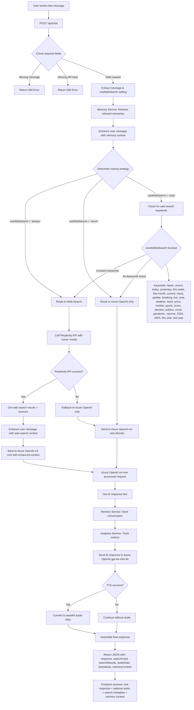
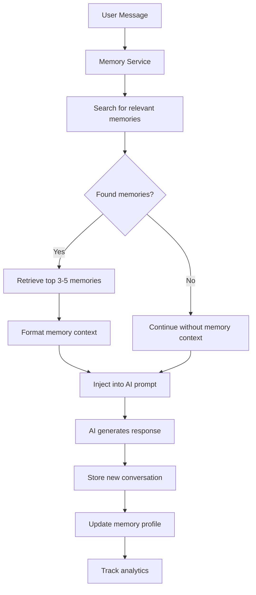
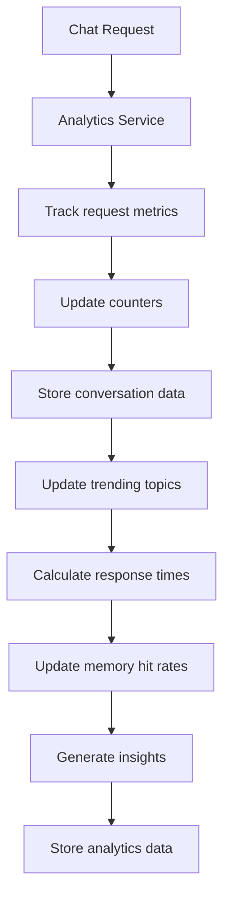
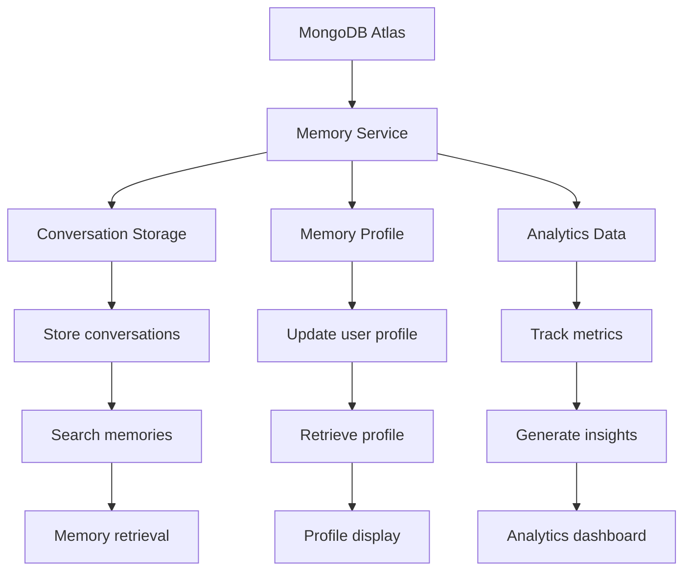
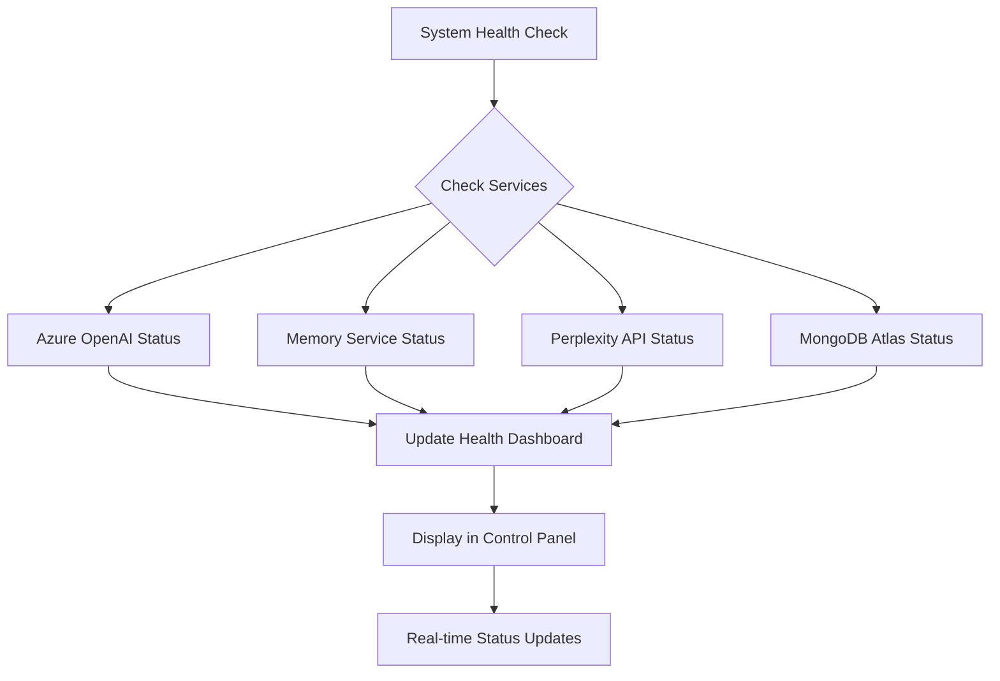

# AIMCS Backend Flow Logic Diagram

## Complete System Architecture



## Memory Integration Flow



## Analytics Tracking System



## Decision Logic Details

### 1. **Enhanced Routing Decision Matrix**

| User Setting | Keyword Detection | Memory Context | Final Route |
|--------------|------------------|----------------|-------------|
| `always` | Any | Available | Perplexity Web Search → Azure OpenAI (with memory) |
| `never` | Any | Available | Azure OpenAI Only (with memory) |
| `auto` | Contains keywords | Available | Perplexity Web Search → Azure OpenAI (with memory) |
| `auto` | No keywords | Available | Azure OpenAI Only (with memory) |

### 2. **Memory Integration**

**Memory Retrieval Process:**
- Search for relevant memories based on user message
- Retrieve top 3-5 most relevant memories
- Format memory context for AI prompt injection
- Store new conversation after AI response

**Memory Storage:**
- Store conversation with timestamp
- Update user memory profile
- Track memory access patterns
- Calculate memory hit rates

### 3. **Analytics Tracking**

**Metrics Tracked:**
- Total conversations
- Web search usage rate
- Memory retrieval success rate
- Average response times
- Trending topics
- User engagement patterns

**Analytics Endpoints:**
- `/api/analytics/summary` - Overview statistics
- `/api/analytics/trending` - Popular topics
- `/api/analytics/performance` - System performance

### 4. **Model Usage**

| Service | Model | Purpose | Input | Output |
|---------|-------|---------|-------|--------|
| **Memory Service** | MongoDB Atlas | Memory retrieval & storage | User message | Relevant memories |
| **Perplexity** | `sonar` | Web search & current info | User query | Search results + sources |
| **Azure OpenAI** | `o4-mini` | AI response generation | Enhanced message (memory + web search) | Text response |
| **Azure OpenAI** | `gpt-4o-mini-tts` | Text-to-speech | AI response text | MP3 audio (base64) |

### 5. **Enhanced Response Structure**

```json
{
  "id": "timestamp",
  "response": "AI generated text response",
  "timestamp": "ISO timestamp",
  "searchUsed": true/false,
  "originalMessage": "user's original query",
  "searchResults": [{"title": "...", "snippet": "...", "url": "..."}],
  "audioData": "base64_encoded_mp3_audio",
  "audioFormat": "audio/mp3",
  "memoryContext": {
    "retrievedMemories": ["memory1", "memory2"],
    "memoryHitRate": "85%",
    "conversationContinued": true/false
  },
  "analytics": {
    "responseTime": "2.3s",
    "searchUsed": true,
    "memoryRetrieved": true
  }
}
```

## Memory Service Architecture



## Key System Features

### 1. **Memory Integration**
- **Smart Memory Retrieval**: Automatically finds relevant past conversations
- **Memory Injection**: Enhances AI responses with historical context
- **Memory Storage**: Stores all conversations for future reference
- **Memory Analytics**: Tracks memory hit rates and usage patterns

### 2. **Enhanced Analytics**
- **Real-time Tracking**: Monitors all system interactions
- **Performance Metrics**: Response times, success rates, usage patterns
- **Trending Analysis**: Identifies popular topics and user interests
- **System Health**: Monitors backend services and API performance

### 3. **Hybrid Intelligence**
- **Web Search + AI**: Perplexity for current info, Azure OpenAI for responses
- **Memory + Context**: Historical conversations enhance current responses
- **Fallback Strategy**: Graceful degradation when services are unavailable
- **Multi-modal Output**: Text responses with optional audio synthesis

### 4. **User Experience**
- **Conversation Continuity**: AI remembers past interactions
- **Smart Search**: Automatic web search when needed
- **Audio Responses**: Text-to-speech for all responses
- **Analytics Dashboard**: Real-time insights and system status

## System Health Monitoring



This updated architecture reflects the complete AIMCS system with memory integration, analytics tracking, and enhanced user experience features. 