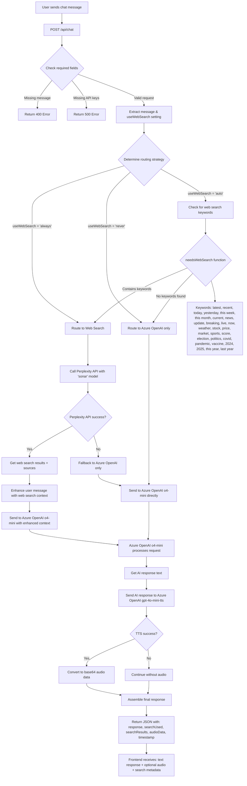

# AIMCS Backend Flow Logic Diagram

## Chat Request Processing Flow



## Decision Logic Details

### 1. **Routing Decision Matrix**

| User Setting | Keyword Detection | Final Route |
|--------------|------------------|-------------|
| `always` | Any | Perplexity Web Search → Azure OpenAI |
| `never` | Any | Azure OpenAI Only |
| `auto` | Contains keywords | Perplexity Web Search → Azure OpenAI |
| `auto` | No keywords | Azure OpenAI Only |

### 2. **Web Search Keywords (needsWebSearch function)**

**Time-based keywords:**
- `latest`, `recent`, `today`, `yesterday`
- `this week`, `this month`, `this year`, `last year`
- `current`, `now`, `2024`, `2025`

**News/Updates keywords:**
- `news`, `update`, `breaking`, `live`

**Real-time data keywords:**
- `weather`, `stock`, `price`, `market`
- `sports`, `score`

**Current events keywords:**
- `election`, `politics`, `covid`, `pandemic`, `vaccine`

### 3. **Model Usage**

| Service | Model | Purpose | Input | Output |
|---------|-------|---------|-------|--------|
| **Perplexity** | `sonar` | Web search & current info | User query | Search results + sources |
| **Azure OpenAI** | `o4-mini` | AI response generation | User message (enhanced if web search used) | Text response |
| **Azure OpenAI** | `gpt-4o-mini-tts` | Text-to-speech | AI response text | MP3 audio (base64) |

### 4. **Response Flow**

1. **Web Search Path** (when applicable):
   ```
   User Query → Perplexity Sonar → Enhanced Query → Azure OpenAI o4-mini → Response Text → TTS → Final Response
   ```

2. **Direct Path** (when no web search):
   ```
   User Query → Azure OpenAI o4-mini → Response Text → TTS → Final Response
   ```

### 5. **Response Structure**

```json
{
  "id": "timestamp",
  "response": "AI generated text response",
  "timestamp": "ISO timestamp",
  "searchUsed": true/false,
  "originalMessage": "user's original query",
  "searchResults": [{"title": "...", "snippet": "...", "url": "..."}],
  "audioData": "base64_encoded_mp3_audio",
  "audioFormat": "audio/mp3"
}
```

## Key Insights

1. **Hybrid Approach**: The system doesn't choose between Perplexity OR Azure OpenAI - it uses Perplexity for current information, then Azure OpenAI for response generation.

2. **Fallback Strategy**: If Perplexity fails, it gracefully falls back to Azure OpenAI only.

3. **Enhanced Context**: When web search is used, the user's query is enhanced with current information before being sent to Azure OpenAI.

4. **Always TTS**: Regardless of the routing path, the final AI response always goes through text-to-speech conversion.

5. **Flexible Control**: Users can override the automatic keyword detection with explicit settings. 