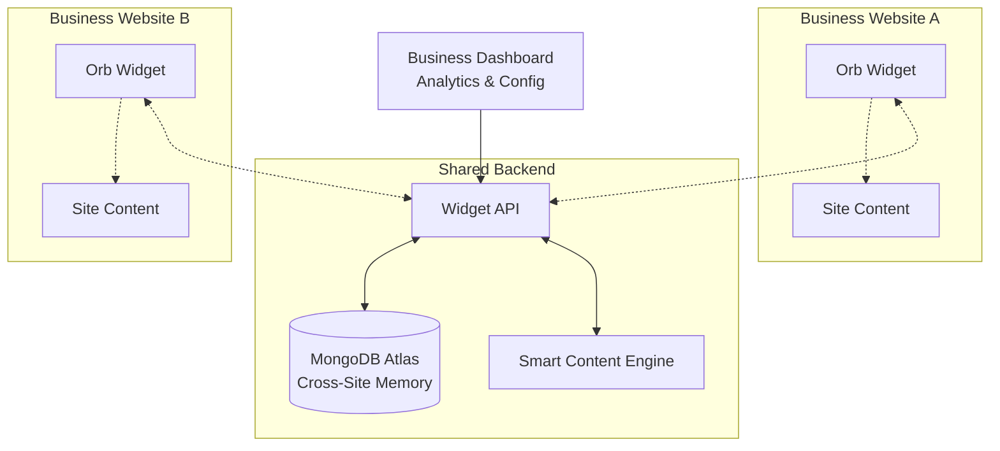

# Orb Game – Embeddable Widget for Business Engagement

_Last updated: 2025-07-16 (Business Widget Edition)_

---

## 1. Purpose & Vision
The **Orb Game Widget** is a lightweight, embeddable engagement tool that businesses can drop into their websites to increase dwell time and user satisfaction. Like LinkedIn's puzzle games, it provides a quick dopamine hit while users browse, encouraging them to stick around and explore more content. The widget learns from MongoDB Atlas memory storage across all sites, creating personalized experiences that adapt and improve over time.

**Key Goals:**
- **2-5 minute engagement boost** per site visit
- **Easy embedding** - one script tag for any business
- **Cross-site learning** - user preferences follow them everywhere
- **Dopamine-driven design** - instant gratification and streaks
- **Business customization** - topics relevant to each industry

## 2. Widget Architecture


## 3. Business Integration & Embedding

### 3.1 Simple Embedding
```html
<!-- One-line embed for any business website -->
<script src="https://orbgame.aimcs.net/widget.js" 
        data-business-id="tech-startup-123"
        data-theme="technology"
        data-position="bottom-right">
</script>
```

### 3.2 Widget Customization Options
| Parameter | Example | Description |
|-----------|---------|-------------|
| `data-business-id` | `"coffee-shop-sf"` | Unique identifier for analytics |
| `data-theme` | `"food"`, `"tech"`, `"finance"` | Industry-relevant topics |
| `data-position` | `"bottom-right"`, `"sidebar"` | Widget placement |
| `data-size` | `"mini"`, `"standard"`, `"large"` | Widget dimensions |
| `data-trigger` | `"auto"`, `"click"`, `"scroll"` | When to show widget |

### 3.3 Business-Specific Content
- **Coffee Shop**: "New Espresso Trends", "Sustainable Sourcing", "Latte Art Tips"
- **Tech Company**: "AI Breakthroughs", "Startup Success Stories", "Innovation News"  
- **Real Estate**: "Market Trends", "Home Design Ideas", "Investment Tips"
- **Fitness Studio**: "Wellness Tips", "Nutrition Science", "Workout Innovations"

## 4. Dopamine-Driven Engagement Design

### 4.1 Micro-Interactions for Quick Wins
- **Instant feedback**: Satisfying "pop" sound on topic discovery
- **Progress bars**: Visual completion of daily challenges
- **Streak counters**: "3 days in a row!" celebrations
- **Point animations**: Numbers that fly up and sparkle
- **Achievement unlocks**: Badge notifications with confetti

### 4.2 Time-Optimized Gameplay
- **30-second topics**: Quick audio bites perfect for attention spans
- **Daily mini-challenges**: "Discover 3 topics today" 
- **Streak mechanics**: Comeback tomorrow for bonus points
- **Social proof**: "47 people discovered this topic today"
- **Progress persistence**: Continue where you left off across sites

### 4.3 MongoDB Atlas Memory Schema
```javascript
// Cross-site user engagement tracking
{
  userId: "anon_abc123", // Anonymous but persistent
  sites: {
    "coffee-shop-sf": {
      visits: 23,
      totalTimeSpent: 847, // seconds
      favoriteTopics: ["coffee", "sustainability"],
      streak: 5,
      lastVisit: ISODate,
      achievements: ["coffee-connoisseur", "daily-visitor"]
    },
    "tech-startup-123": {
      visits: 8,
      totalTimeSpent: 324,
      favoriteTopics: ["ai", "startups"],
      streak: 2,
      lastVisit: ISODate,
      achievements: ["tech-explorer"]
    }
  },
  globalPreferences: {
    preferredVoice: "alloy",
    playbackSpeed: 1.0,
    favoriteCategories: ["technology", "science"],
    personalityType: "quick-learner" // ML-derived
  },
  crossSitePatterns: {
    bestTimeOfDay: "14:00-16:00",
    averageSessionLength: 156, // seconds
    topicJumpPattern: ["tech" -> "business" -> "science"],
    engagementTriggers: ["streaks", "achievements", "social-proof"]
  }
}
```

## 5. Business Dashboard & Analytics

### 5.1 Real-Time Engagement Metrics
- **Dwell time increase**: Average extra minutes per visitor
- **Return visit rate**: How often users come back
- **Topic engagement**: Which content keeps people longest
- **Conversion correlation**: Widget usage vs. business goals
- **Peak engagement times**: When users are most active

### 5.2 Customization Controls
- **Content themes**: Industry-specific topic curation
- **Trigger timing**: When widget appears (scroll %, time delay)
- **Visual styling**: Colors, position, animation style
- **Goal alignment**: Link achievements to business actions
- **A/B testing**: Compare widget variations

## 6. Cross-Site Learning & Personalization

### 6.1 Smart Content Engine
```javascript
// Personalized topic recommendation
function getRecommendedTopics(userId, currentSite) {
  const userMemory = await getUserMemory(userId);
  const siteTheme = getSiteTheme(currentSite);
  
  // Blend user preferences with site relevance
  return ml.recommend({
    userHistory: userMemory.globalPreferences,
    siteContext: siteTheme,
    timeOfDay: new Date().getHours(),
    recentEngagement: userMemory.crossSitePatterns
  });
}
```

### 6.2 Adaptive Difficulty & Pacing
- **Session length prediction**: Adjust content to expected visit duration
- **Interest decay modeling**: Rotate topics before user gets bored
- **Skill progression**: Gradually introduce more complex topics
- **Mood detection**: Lighter content during stressful browsing patterns

## 7. Deployment & Monetization

### 7.1 SaaS Widget Service
- **Free tier**: Basic widget for small businesses (1k monthly interactions)
- **Pro tier**: Custom themes, advanced analytics ($29/month)
- **Enterprise**: White-label, custom integrations ($299/month)
- **Revenue sharing**: Split ad revenue from content partnerships

### 7.2 Technical Infrastructure
- **CDN delivery**: Sub-100ms load times globally
- **Fallback modes**: Graceful degradation for slow connections
- **Privacy compliance**: GDPR/CCPA compliant anonymous tracking
- **Performance monitoring**: Real-time widget health across all sites

## 8. Implementation Phases

### Phase 1: MVP Widget (Week 1-2)
- Basic orb with 5-topic rotation
- Simple embedding script
- MongoDB user preference storage
- 3 business themes (tech, retail, health)

### Phase 2: Engagement Optimization (Week 3-4)
- Dopamine mechanics (streaks, achievements)
- Cross-site memory synchronization
- Business dashboard basics
- A/B testing framework

### Phase 3: Scale & Customize (Week 5-8)
- 20+ industry themes
- Advanced ML recommendations
- Enterprise features
- Performance optimization

### Phase 4: Network Effects (Week 9-12)
- Social features between sites
- Community challenges
- Content partnerships
- Monetization launch

---

## 9. Success Metrics & Business Value

### Widget Success Indicators
- **Dwell time**: +2-5 minutes average per visit
- **Return visits**: +30% weekly return rate
- **User satisfaction**: 4.5+ star ratings
- **Business impact**: Measurable conversion lift

### Competitive Advantages
- **Cross-site learning**: Unique user intelligence
- **Industry customization**: Relevant content for every business
- **Zero friction**: One-script deployment
- **Continuous improvement**: MongoDB-powered personalization

This widget transforms the educational Orb Game into a powerful business engagement tool that learns and improves across an entire network of websites, creating lasting value for both users and businesses! 🚀 